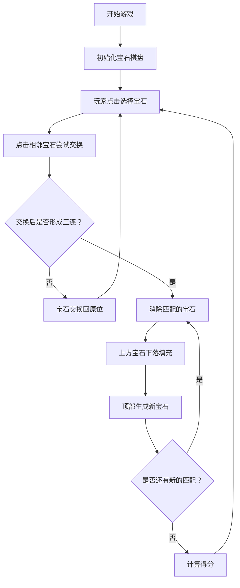

## 1. 产品概述

宝石迷阵是一款经典的三消类休闲游戏，玩家通过交换相邻宝石，使三个或更多相同颜色的宝石连成一线进行消除，获得分数。游戏具有简单易上手、趣味性强的特点，适合各年龄段玩家。

- 主要目的：提供轻松有趣的休闲娱乐体验
- 目标用户：休闲游戏爱好者
- 产品价值：经典三消玩法，精美的视觉效果，流畅的操作体验

## 2. 核心功能

### 2.1 功能模块

1. **游戏主界面**：宝石棋盘、分数显示、操作提示
2. **游戏核心玩法**：宝石交换、三连消除、递归消除、下落填充
3. **游戏状态管理**：分数计算、游戏结束判断、重新开始

### 2.2 页面详情

| 页面名称 | 模块名称 | 功能描述 |
|-----------|-------------|---------------------|
| 游戏主页面 | 宝石棋盘 | 8x8 的宝石网格，支持点击选择和交换相邻宝石 |
| 游戏主页面 | 分数面板 | 实时显示当前得分、消除宝石数量 |
| 游戏主页面 | 控制按钮 | 重新开始游戏按钮 |
| 游戏主页面 | 游戏提示 | 显示操作说明和游戏状态 |

## 3. 核心流程

玩家进入游戏后，看到一个充满彩色宝石的棋盘。玩家点击选中一个宝石，再点击相邻的宝石进行交换。如果交换后形成三个或更多同色宝石连成一线，则触发消除，消除后上方宝石下落，顶部填充新宝石，并递归检测新的消除。每次消除获得分数，玩家可以不断挑战更高分数。

## 4. 用户界面设计

### 4.1 设计风格

- **设计风格**：现代炫彩风格，宝石圆润有光泽，背景深色渐变突出宝石色彩
- **主色调**：深色背景（深蓝/深紫渐变），配合多种鲜艳的宝石颜色
- **宝石颜色**：红色、蓝色、绿色、黄色、紫色、橙色六种颜色
- **按钮风格**：圆角矩形，带有渐变和阴影效果
- **字体**：现代无衬线字体，清晰易读
- **动画效果**：宝石消除有缩放淡出动画，下落有平滑过渡，选中有高亮发光效果

### 4.2 页面设计概览

| 页面名称 | 模块名称 | UI 元素 |
|-----------|-------------|-------------|
| 游戏主页面 | 宝石棋盘 | 8x8 网格、圆形宝石、选中高亮、消除动画、下落动画 |
| 游戏主页面 | 分数面板 | 大号数字、渐变文字、图标装饰 |
| 游戏主页面 | 控制按钮 | 圆角按钮、悬停效果、点击反馈 |
| 游戏主页面 | 游戏提示 | 半透明卡片、简洁文字说明 |

### 4.3 响应式设计

- 以桌面端为主要设计目标
- 支持移动端自适应，棋盘大小根据屏幕尺寸调整
- 触摸操作优化，确保在手机上也能流畅操作
