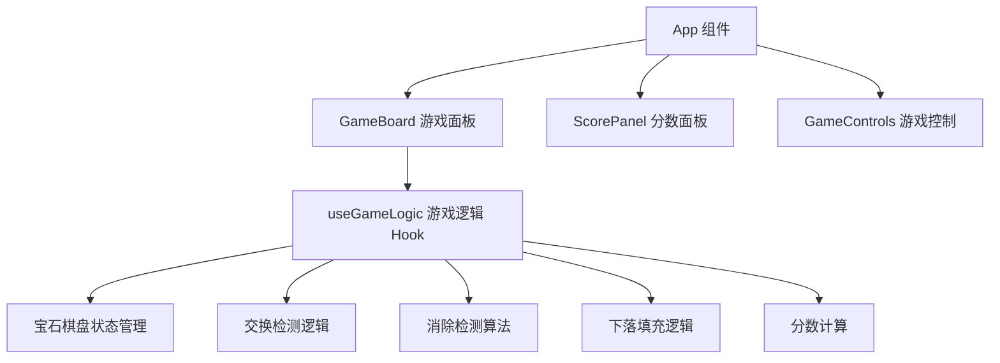

## 1. 架构设计

本项目为纯前端游戏应用，采用 React + TypeScript + Vite 技术栈构建。游戏逻辑与 UI 渲染分离，核心游戏逻辑封装在自定义 Hook 中，UI 组件负责展示和交互。



## 2. 技术描述

- **前端框架**：React 18 + TypeScript
- **构建工具**：Vite
- **样式方案**：TailwindCSS 3
- **状态管理**：React useState/useReducer（轻量级游戏状态）
- **动画实现**：CSS Transitions + CSS Keyframes
- **无后端**：纯前端游戏，数据存储在内存中

## 3. 项目结构

```
src/
├── components/
│   ├── GameBoard.tsx       # 游戏棋盘组件
│   ├── Gem.tsx             # 单个宝石组件
│   ├── ScorePanel.tsx      # 分数面板组件
│   └── GameControls.tsx    # 游戏控制按钮组件
├── hooks/
│   └── useGameLogic.ts     # 游戏核心逻辑 Hook
├── types/
│   └── game.ts             # 类型定义
├── utils/
│   └── gemUtils.ts         # 宝石相关工具函数
├── App.tsx                 # 主应用组件
├── main.tsx                # 入口文件
└── index.css               # 全局样式
```

## 4. 核心数据模型

### 4.1 宝石类型

```typescript
type GemType = 'red' | 'blue' | 'green' | 'yellow' | 'purple' | 'orange';

interface Gem {
  id: string;
  type: GemType;
  row: number;
  col: number;
  isMatched: boolean;
  isNew: boolean;
}
```

### 4.2 游戏状态

```typescript
interface GameState {
  board: Gem[][];
  score: number;
  selectedGem: { row: number; col: number } | null;
  isAnimating: boolean;
  moves: number;
}
```

## 5. 核心算法

### 5.1 匹配检测算法
- 横向扫描：检测每行中连续相同颜色的宝石
- 纵向扫描：检测每列中连续相同颜色的宝石
- 返回所有匹配的宝石坐标集合

### 5.2 下落填充算法
- 从下往上遍历每列
- 遇到空格时，将上方宝石下移
- 顶部生成新的随机宝石

### 5.3 递归消除
- 检测匹配 → 消除 → 下落 → 填充 → 再检测
- 循环直到没有新的匹配为止
