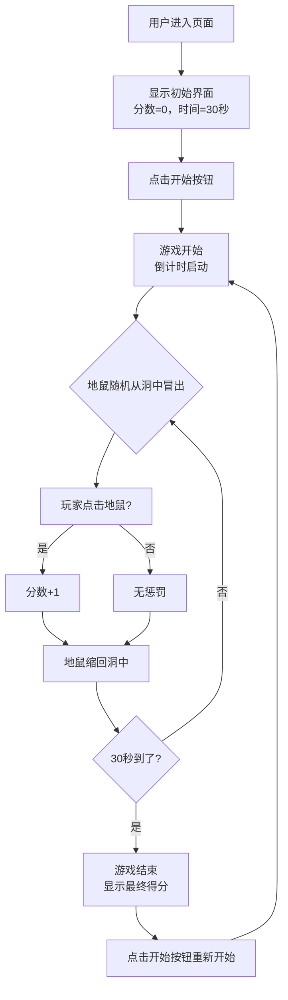

## 1. 产品概述

打地鼠是一款经典休闲小游戏，玩家在限定时间内点击随机冒出的地鼠获得分数。游戏操作简单、节奏明快，适合各年龄段用户放松消遣。

## 2. 核心功能

### 2.1 功能模块

1. **游戏主界面**：顶部状态栏、3x3 地鼠洞网格、开始按钮
2. **计分系统**：点击地鼠加 1 分，实时显示
3. **计时系统**：30 秒倒计时，时间到自动结束
4. **地鼠动画**：地鼠随机冒出、停留、缩回
5. **游戏状态控制**：开始、进行中、结束三种状态

### 2.2 页面详情

| 页面名称 | 模块名称 | 功能描述 |
|----------|----------|----------|
| 游戏主页面 | 状态栏 | 显示剩余时间和当前分数 |
| 游戏主页面 | 地鼠网格 | 3 行 3 列共 9 个地鼠洞，地鼠随机冒出 |
| 游戏主页面 | 开始按钮 | 点击开始或重新开始游戏 |
| 游戏主页面 | 结束提示 | 时间到后弹出游戏结束提示和最终得分 |

## 3. 核心流程

## 4. 用户界面设计

### 4.1 设计风格

- **主色调**：草地绿 (#6ab04c) + 泥土棕 (#8B4513)，营造户外田园氛围
- **点缀色**：地鼠棕 (#A0522D)、警示红 (#e74c3c)（时间不足时）
- **按钮风格**：圆角、饱满的绿色按钮，带轻微阴影和点击反馈
- **字体**：使用圆润可爱的无衬线字体，标题加粗
- **布局**：居中卡片式布局，顶部状态栏 + 中部游戏区 + 底部控制区
- **动效**：地鼠冒出/缩回采用平滑弹性动画，点击时有微缩放反馈

### 4.2 页面设计概览

| 页面名称 | 模块名称 | UI 元素 |
|----------|----------|---------|
| 游戏主页面 | 状态栏 | 大号时间显示、分数徽章、水平排列 |
| 游戏主页面 | 地鼠网格 | 3x3 等大圆角方块作为洞口，洞口有立体阴影 |
| 游戏主页面 | 开始按钮 | 居中放置，大号绿色圆角按钮 |
| 游戏主页面 | 结束提示 | 半透明遮罩 + 居中卡片，显示分数和再来一局 |

### 4.3 响应式

桌面端优先设计，移动端自适应：
- 地鼠网格在小屏幕上自动调整大小
- 按钮和文字支持触控点击
- 整体布局保持居中对齐
