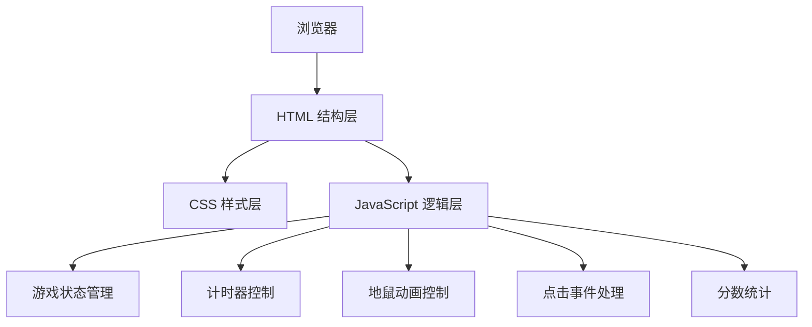

## 1. 架构设计



## 2. 技术说明

- **前端**：原生 HTML5 + CSS3 + 原生 JavaScript（ES6+）
- **构建工具**：无，纯静态文件直接运行
- **动画**：CSS3 Transition/Keyframes
- **部署**：直接在浏览器打开 index.html 即可运行

## 3. 文件结构

```
dadishu/
├── index.html      # 主页面结构
├── style.css       # 样式文件
└── script.js       # 游戏逻辑
```

## 4. 核心数据结构

```javascript
// 游戏状态
const GameState = {
  IDLE: 'idle',       // 未开始
  PLAYING: 'playing', // 进行中
  OVER: 'over'        // 已结束
};

// 游戏数据
const game = {
  state: GameState.IDLE,
  score: 0,
  timeLeft: 30,
  currentHole: -1,    // 当前地鼠所在洞索引 (-1 表示无)
  moleTimer: null,    // 地鼠消失计时器
  gameTimer: null     // 游戏倒计时器
};
```

## 5. 核心函数设计

| 函数名 | 功能 |
|--------|------|
| `startGame()` | 初始化并开始游戏 |
| `endGame()` | 结束游戏，显示结果 |
| `popMole()` | 随机选择一个洞让地鼠冒出 |
| `hideMole()` | 让当前地鼠缩回 |
| `handleWhack(index)` | 处理点击地鼠事件 |
| `updateDisplay()` | 更新分数和时间显示 |
