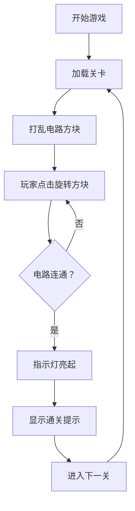

# 电路连通模拟器 - 产品需求文档

## 1. 产品概述

电路连通模拟器是一款益智解谜游戏，玩家通过旋转电路方块来接通整个电路，使指示灯亮起表示通关。游戏从简单的 3×3 网格开始，随着关卡推进难度逐渐增加到 n×n。

- 核心玩法：旋转电路方块，使电路从电源端连通到指示灯端
- 目标用户：所有年龄段的益智游戏爱好者
- 产品价值：提供有趣的逻辑思维训练体验

## 2. 核心功能

### 2.1 功能模块

1. **游戏主界面**：电路网格、电源指示灯、控制面板
2. **关卡系统**：多关卡递进，难度从 3×3 逐步增加
3. **交互系统**：点击旋转方块、电路连通检测
4. **状态显示**：当前关卡、步数统计、通关提示

### 2.2 页面详情

| 页面名称 | 模块名称 | 功能描述 |
|-----------|-------------|---------------------|
| 游戏主页面 | 电路网格区域 | 显示可旋转的电路方块，点击旋转 |
| 游戏主页面 | 状态栏 | 显示当前关卡、旋转步数、电源/指示灯状态 |
| 游戏主页面 | 控制面板 | 关卡选择、重置、下一关按钮 |

## 3. 核心流程

用户进入游戏后，看到初始打乱的 3×3 电路网格。玩家通过点击方块进行旋转，系统实时检测电路是否连通。当电路从电源端成功连通到指示灯时，指示灯亮起并显示通关提示，玩家可以进入下一关。

## 4. 用户界面设计

### 4.1 设计风格

- **主色调**：深科技蓝色 (#0f172a) 作为背景，搭配明亮的电路青色 (#06b6d4) 作为激活色
- **辅色**：警示红 (#ef4444) 表示电源，成功绿 (#22c55e) 表示连通
- **按钮风格**：圆角矩形，悬停时有光晕效果
- **字体**：使用 JetBrains Mono 等宽字体营造科技感
- **布局风格**：居中卡片式布局，电路网格使用等宽方块

### 4.2 页面设计概述

| 页面名称 | 模块名称 | UI 元素 |
|-----------|-------------|-------------|
| 游戏主页面 | 电路网格 | 深色方块、电路线条、旋转动画、通电动画 |
| 游戏主页面 | 状态栏 | 大号数字显示关卡、步数、动态指示灯 |
| 游戏主页面 | 控制面板 | 玻璃态按钮、悬停效果、过渡动画 |

### 4.3 响应式

- 桌面端优先设计
- 移动端自适应，电路网格按比例缩放
- 触摸设备优化点击区域

### 4.4 视觉特效

- 电路方块旋转时的平滑过渡动画
- 电路连通时的电流流动效果
- 指示灯亮起的脉冲动画
- 页面加载时的渐入效果
