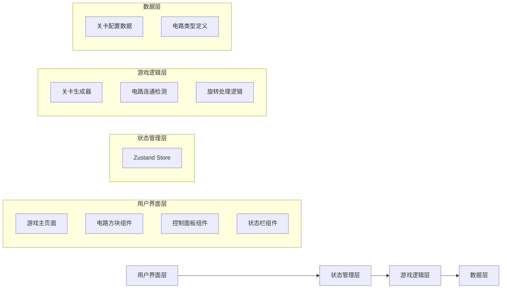

# 电路连通模拟器 - 技术架构文档

## 1. 架构设计



## 2. 技术描述

- **前端框架**：React@18 + TypeScript + Vite
- **样式方案**：TailwindCSS@3
- **状态管理**：Zustand
- **路由**：React Router DOM
- **图标库**：Lucide React

## 3. 路由定义

| 路由 | 页面 | 功能 |
|------|------|------|
| / | 游戏主页面 | 包含电路网格、状态栏、控制面板 |

## 4. 数据模型

### 4.1 电路方块类型

```typescript
// 方向：上、右、下、左
type Direction = 0 | 1 | 2 | 3;

// 电路类型
type CircuitType = 
  | 'straight'    // 直线型：连接相对的两边
  | 'corner'      // 拐角型：连接相邻的两边
  | 'tee'         // T型：连接三个方向
  | 'cross'       // 十字型：连接四个方向
  | 'source'      // 电源
  | 'target';     // 目标（指示灯）

interface CircuitCell {
  type: CircuitType;
  rotation: number;  // 0, 90, 180, 270
  isPowered: boolean;
}

interface GameState {
  level: number;
  gridSize: number;
  grid: CircuitCell[][];
  moves: number;
  isComplete: boolean;
}
```

### 4.2 关卡配置

```typescript
interface LevelConfig {
  level: number;
  gridSize: number;
  sourcePosition: [number, number];
  targetPosition: [number, number];
  minShuffles: number;
}
```

## 5. 核心算法

### 5.1 电路连通检测

使用 BFS/DFS 算法从电源位置开始遍历所有连通的电路方块，检测是否能到达目标位置。

### 5.2 关卡生成

1. 根据关卡号确定网格大小 (3×3, 4×4, 5×5...)
2. 生成一条从电源到目标的有效路径
3. 在路径周围填充其他电路方块
4. 随机旋转所有方块打乱初始状态

### 5.3 旋转处理

每次旋转 90 度，旋转后重新计算电路连通状态。

## 6. 项目结构

```
src/
├── components/
│   ├── CircuitGrid.tsx      # 电路网格组件
│   ├── CircuitCell.tsx      # 单个电路方块组件
│   ├── StatusBar.tsx        # 状态栏组件
│   └── ControlPanel.tsx     # 控制面板组件
├── store/
│   └── useGameStore.ts      # 游戏状态管理
├── utils/
│   ├── circuitLogic.ts      # 电路逻辑工具
│   └── levelGenerator.ts    # 关卡生成器
├── types/
│   └── circuit.ts           # 类型定义
├── data/
│   └── levels.ts            # 关卡配置
├── pages/
│   └── GamePage.tsx         # 游戏主页面
├── App.tsx
└── main.tsx
```
