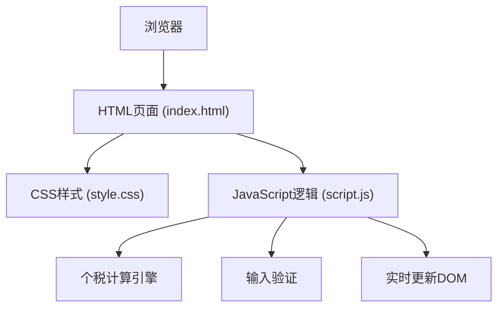

## 1. 架构设计



## 2. 技术描述
- 前端：纯 HTML5 + CSS3 + JavaScript (ES6+)
- 无需框架和构建工具，直接在浏览器运行
- 无后端依赖，纯前端计算
- 样式使用 CSS 变量和 Glassmorphism 效果

## 3. 文件结构
| 文件 | 用途 |
|-------|---------|
| index.html | 主页面，包含表单和结果展示结构 |
| style.css | 样式文件，玻璃态效果、透明淡蓝色窗口 |
| script.js | 计算逻辑、事件处理、实时更新 |

## 4. 个税计算逻辑

### 4.1 计算公式
1. 应纳税所得额 = 税前工资 - 五险一金 - 起征点(5000) - 专项附加扣除
2. 应缴个税 = 应纳税所得额 × 税率 - 速算扣除数
3. 税后工资 = 税前工资 - 五险一金 - 应缴个税

### 4.2 个税税率表（2024年标准）
| 级数 | 应纳税所得额 | 税率 | 速算扣除数 |
|------|-------------|------|-----------|
| 1 | 不超过3000元 | 3% | 0 |
| 2 | 超过3000元至12000元 | 10% | 210 |
| 3 | 超过12000元至25000元 | 20% | 1410 |
| 4 | 超过25000元至35000元 | 25% | 2660 |
| 5 | 超过35000元至55000元 | 30% | 4410 |
| 6 | 超过55000元至80000元 | 35% | 7160 |
| 7 | 超过80000元 | 45% | 15160 |

### 4.3 默认参数
- 起征点：5000元/月
- 养老保险：8%
- 医疗保险：2%
- 失业保险：0.5%
- 住房公积金：12%
- 工伤和生育保险：个人不缴纳

## 5. 核心函数定义

```javascript
// 计算五险一金
function calculateSocialInsurance(salary, rates) => {
    // 返回各项保险扣除金额和总额
}

// 计算应纳税所得额
function calculateTaxableIncome(salary, socialInsurance, threshold, specialDeduction) => {
    // 返回应纳税所得额
}

// 计算个税
function calculatePersonalIncomeTax(taxableIncome) => {
    // 根据税率表计算个税
}

// 格式化金额显示
function formatCurrency(amount) => {
    // 格式化为人民币显示
}

// 实时计算并更新页面
function updateCalculation() => {
    // 获取输入值，调用计算函数，更新DOM
}
```
