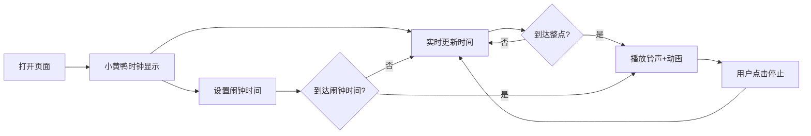

## 1. 产品概述
卡通小黄鸭桌面闹钟WEB应用，提供实时时钟显示、整点自动报时和定时提醒功能，采用可爱的黄色小黄鸭卡通风格设计。
- 主要用途：桌面时钟显示、闹钟提醒工具
- 目标用户：需要可爱风格闹钟的普通用户

## 2. 核心功能

### 2.1 功能模块
1. **主页面**：小黄鸭卡通时钟显示、当前时间、闹钟设置面板

### 2.2 页面详情
| 页面名称 | 模块名称 | 功能描述 |
|-----------|-------------|---------------------|
| 主页面 | 小黄鸭卡通时钟 | 实时显示当前时间，小黄鸭造型，帽子带闹铃 |
| 主页面 | 整点报时 | 整点时自动播放铃声，闹铃动画效果 |
| 主页面 | 定时提醒设置 | 用户可设置闹钟时间，到达时间播放提醒 |
| 主页面 | 闹钟控制 | 开启/关闭闹钟、停止铃声 |

## 3. 核心流程
用户打开页面看到小黄鸭时钟实时显示时间，可通过设置面板设置闹钟时间。到达设定时间或整点时，闹铃动画播放并发出铃声，用户可点击停止铃声。

## 4. 用户界面设计
### 4.1 设计风格
- 主色调：黄色（#FFD700、#FFC107），搭配橙色和白色
- 按钮风格：圆角卡通按钮，带有阴影效果
- 字体：圆润可爱的无衬线字体
- 布局：居中布局，小黄鸭为视觉中心
- 动画：闹铃摇摆动画、鸭子眨眼动画

### 4.2 页面设计概述
| 页面名称 | 模块名称 | UI元素 |
|-----------|-------------|-------------|
| 主页面 | 小黄鸭时钟 | 黄色身体、橙色嘴巴、黑色眼睛、帽子带闹铃 |
| 主页面 | 时间显示 | 大号数字时钟，位于小黄鸭身体 |
| 主页面 | 设置面板 | 时间选择器、开关按钮、操作按钮 |

### 4.3 响应性
- 桌面优先设计，适配不同屏幕尺寸
- 移动端自适应布局
