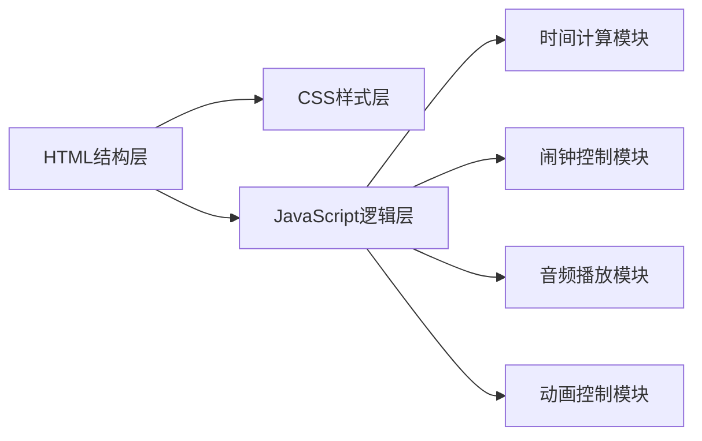

## 1. 架构设计
纯前端WEB应用，使用原生HTML、CSS、JavaScript实现。

## 2. 技术描述
- 前端技术：HTML5 + CSS3 + 原生JavaScript (ES6+)
- 音频：Web Audio API 或 HTML5 Audio 实现铃声播放
- 动画：CSS3 Animation + JavaScript 控制
- 文件结构：
  - index.html - 页面结构
  - style.css - 样式文件
  - script.js - 逻辑脚本

## 3. 文件结构
| 文件 | 用途 |
|-------|---------|
| index.html | 页面主结构，包含小黄鸭SVG、时间显示、控制面板 |
| style.css | 所有样式定义，卡通风格CSS，动画效果 |
| script.js | 时钟逻辑、闹钟控制、音频播放、事件处理 |

## 4. 核心功能实现
### 4.1 时钟模块
- 使用 setInterval 每秒更新时间显示
- Date 对象获取当前时间
- 格式化时分秒显示

### 4.2 闹钟模块
- localStorage 保存闹钟设置
- 定时检查当前时间与闹钟时间匹配
- 整点检测逻辑

### 4.3 音频模块
- 使用 Web Audio API 生成闹铃音效
- 或使用 Audio 对象播放音频文件
- 支持停止和重复播放

### 4.4 动画模块
- CSS @keyframes 定义闹铃摇摆动画
- JavaScript 控制动画类的添加和移除
- 鸭子眨眼等小动画增强趣味性
