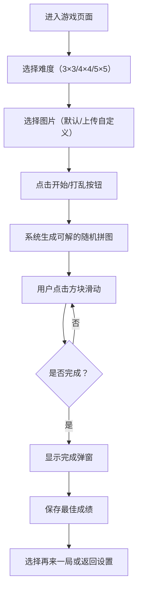

## 1. 产品概述
拼图滑块游戏是一款基于数字华容道玩法的休闲益智游戏，用户通过移动方块将打乱的图片复原。支持自定义图片上传、多种难度网格选择，提供流畅的滑动动画和计时统计功能。

- 主要用途：休闲娱乐、益智训练、图片个性化展示
- 目标用户：喜欢益智类小游戏的普通用户、喜欢个性化定制的年轻用户
- 产品价值：将经典数字华容道与图片拼图结合，提供既熟悉又新颖的游戏体验

## 2. 核心功能

### 2.1 用户角色
| 角色 | 注册方式 | 核心权限 |
|------|----------|----------|
| 普通用户 | 无需注册，直接使用 | 开始游戏、选择难度、上传自定义图片、查看历史记录 |

### 2.2 功能模块
1. **主游戏页面**：游戏设置区、拼图棋盘区、状态信息区、操作按钮区
2. **图片选择模块**：默认图片库、本地上传图片、图片预览
3. **难度选择模块**：3×3简单、4×4中等、5×5困难三种网格模式
4. **游戏统计模块**：步数计数、计时器、最佳成绩记录
5. **游戏控制模块**：开始游戏、打乱、重置、提示、撤销

### 2.3 页面详情
| 页面名称 | 模块名称 | 功能描述 |
|-----------|-------------|---------------------|
| 主游戏页面 | 游戏设置区 | 难度选择（3×3/4×4/5×5）、图片选择（默认/上传）、开始按钮 |
| 主游戏页面 | 拼图棋盘区 | N×N网格方块、可滑动动画、空白位置标识、完成检测 |
| 主游戏页面 | 状态信息区 | 实时步数显示、计时器显示、当前难度显示 |
| 主游戏页面 | 操作按钮区 | 打乱/重置、提示预览原图、撤销上一步 |
| 主游戏页面 | 完成弹窗 | 恭喜提示、用时步数统计、再来一局按钮 |
| 图片上传弹窗 | 上传区域 | 拖拽上传、点击选择文件、图片预览、裁剪/确认 |

## 3. 核心流程
用户进入游戏后选择难度和图片，点击开始后系统打乱拼图，用户通过点击与空白相邻的方块进行滑动，系统实时记录步数和时间，完成后弹出祝贺窗口并保存最佳成绩。

## 4. 用户界面设计

### 4.1 设计风格
- **主色调**：深邃靛蓝渐变（#1e3a8a → #3730a3）配以霓虹青绿色高亮（#2dd4bf）
- **辅助色**：暖橙色强调（#f59e0b）、珊瑚粉完成提示（#fb7185）
- **背景**：深色模式，带有微妙的几何图案纹理和光晕效果
- **按钮风格**：圆角胶囊形，带悬浮上浮动效和发光阴影
- **字体**：标题使用 Space Grotesk，正文使用 DM Sans，数字使用 JetBrains Mono
- **图标风格**：线性风格，圆润描边，配合微妙的颜色填充
- **整体氛围**：现代科技感 + 休闲游戏感，暗色主题护眼

### 4.2 页面设计概述
| 页面名称 | 模块名称 | UI元素 |
|-----------|-------------|-------------|
| 主游戏页面 | 游戏设置区 | 卡片式布局、难度按钮组（选中高亮发光）、图片选择器、悬浮提示 |
| 主游戏页面 | 拼图棋盘区 | 玻璃拟态容器、方块带图片背景+数字角标、滑动过渡动画（300ms cubic-bezier）、完成时发光边框动画 |
| 主游戏页面 | 状态信息区 | 数字统计卡片、渐变背景、固定在棋盘上方横向排列 |
| 主游戏页面 | 操作按钮区 | 图标+文字按钮、等距排列、禁用态灰度显示 |
| 完成弹窗 | 信息展示 | 模糊背景遮罩、缩放进入动画、彩带粒子效果、统计数据高亮 |
| 图片上传弹窗 | 上传区域 | 虚线边框、拖拽高亮、图片预览圆形裁剪、确认按钮 |

### 4.3 响应式设计
- 桌面优先：棋盘最大尺寸 500px×500px
- 平板适配：棋盘缩小至 400px，设置区横向排列
- 手机适配：棋盘宽度 90vw，设置区改为纵向堆叠，按钮尺寸增大便于触控
- 触控优化：所有可点击元素最小尺寸 44px×44px

### 4.4 动画与交互
- 方块滑动：CSS transform + transition，300ms 缓动曲线
- 页面加载：元素错峰淡入（staggered reveal）
- 完成效果：棋盘边框脉冲发光 + 背景粒子彩带
- 按钮交互：hover 上浮 2px + 阴影加深，active 按下回弹
- 计时器：数字变化时轻微缩放动效
