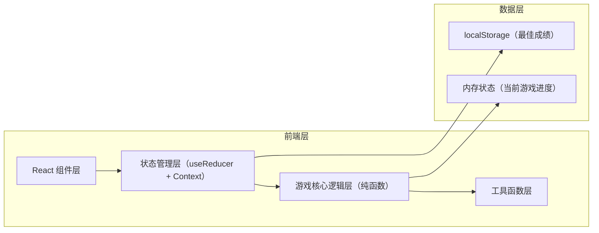

## 1. 架构设计



## 2. 技术描述
- **前端框架**：React@18 + TypeScript
- **构建工具**：Vite@5
- **样式方案**：TailwindCSS@3 + CSS Modules（动画关键帧）
- **状态管理**：React useReducer + Context（轻量级，无需Redux）
- **图片处理**：Canvas API（图片裁剪、分割生成拼图块背景）
- **后端**：无后端，纯前端应用
- **数据存储**：localStorage（保存最佳成绩记录）

## 3. 路由定义
| 路由 | 用途 |
|-------|---------|
| / | 主游戏页面（单页应用，无其他路由） |

## 4. 核心数据结构与类型定义

```typescript
// 难度等级
type Difficulty = 3 | 4 | 5;

// 单个拼图块
interface Tile {
  id: number;           // 原始位置编号 (0 ~ size*size-1, 0 代表空白块)
  currentIndex: number; // 当前在棋盘中的位置索引
  isEmpty: boolean;     // 是否为空白块
}

// 游戏状态
interface GameState {
  tiles: Tile[];                // 所有拼图块数组
  size: Difficulty;             // 当前网格大小
  moves: number;                // 已用步数
  startTime: number | null;     // 开始时间戳
  elapsedTime: number;          // 已用秒数
  isPlaying: boolean;           // 是否正在游戏中
  isCompleted: boolean;         // 是否已完成
  imageUrl: string;             // 当前使用的图片URL
  moveHistory: number[][];      // 移动历史（用于撤销）
  bestRecords: BestRecord[];    // 最佳成绩记录
}

// 最佳成绩记录
interface BestRecord {
  size: Difficulty;
  moves: number;
  time: number;
  date: string;
}

// 游戏动作类型
type GameAction =
  | { type: 'SET_DIFFICULTY'; payload: Difficulty }
  | { type: 'SET_IMAGE'; payload: string }
  | { type: 'SHUFFLE' }
  | { type: 'MOVE_TILE'; payload: number }
  | { type: 'UNDO' }
  | { type: 'RESET' }
  | { type: 'TICK' }
  | { type: 'COMPLETE' };
```

## 5. 核心算法说明

### 5.1 拼图打乱算法（确保可解）
- 从已完成状态开始，执行 N 次随机合法移动（N = size × size × 20）
- 每次随机选择空白块相邻的一个方块进行交换
- 此方法保证生成的拼图 100% 可解

### 5.2 移动合法性判断
- 获取空白块当前位置索引 emptyIndex
- 点击方块索引为 clickedIndex
- 判断是否相邻：
  - 上下相邻：Math.abs(emptyIndex - clickedIndex) === size
  - 左右相邻：需在同一行，且 Math.abs(emptyIndex - clickedIndex) === 1
- 合法则交换两个方块的 currentIndex

### 5.3 完成检测
- 遍历所有 tiles，检查每个 tile 的 id 是否等于 currentIndex
- 全部匹配则判定为完成

## 6. 组件结构

```
src/
├── App.tsx                   # 根组件
├── main.tsx                  # 入口
├── index.css                 # 全局样式 + Tailwind 指令
├── types/
│   └── game.ts               # 类型定义
├── game/
│   ├── reducer.ts            # useReducer 逻辑
│   ├── logic.ts              # 游戏核心算法（打乱、移动、检测）
│   └── utils.ts              # 工具函数（时间格式化等）
├── components/
│   ├── GameBoard.tsx         # 拼图棋盘组件
│   ├── Tile.tsx              # 单个拼图块组件
│   ├── GameControls.tsx      # 控制面板（难度、按钮等）
│   ├── GameStats.tsx         # 状态统计（步数、时间）
│   ├── ImageSelector.tsx     # 图片选择器
│   ├── CompleteModal.tsx     # 完成弹窗
│   └── ImageUploadModal.tsx  # 图片上传弹窗
├── hooks/
│   └── useGameTimer.ts       # 计时器 Hook
└── assets/
    └── default-images.ts     # 默认内置图片数据
```
