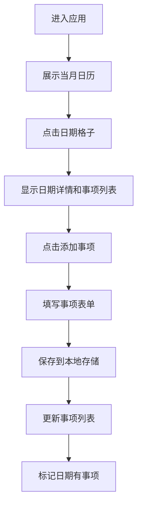

## 1. 产品概述

万年历WEB应用是一款集公历、农历、节假日、星期显示于一体的日程管理工具，支持用户点击日期录入个人事项，帮助用户高效管理时间与日程安排。

- 主要用途：提供直观的日历视图，支持公历/农历双显示，方便用户规划日程
- 目标用户：需要管理日常事务、关注传统农历节日的普通用户
- 产品价值：简洁高效的日程管理，传统文化与现代生活的完美融合

## 2. 核心功能

### 2.1 用户角色

| 角色 | 注册方式 | 核心权限 |
|------|----------|----------|
| 普通用户 | 无需注册，本地存储 | 查看日历、添加/编辑/删除日程事项 |

### 2.2 功能模块

1. **日历主页**：月视图日历展示、日期导航、今日快速定位
2. **日期详情**：公历/农历信息、节假日信息、日程事项列表
3. **事项管理**：添加事项、编辑事项、删除事项、事项提醒

### 2.3 页面详情

| 页面名称 | 模块名称 | 功能描述 |
|-----------|-------------|---------------------|
| 日历主页 | 顶部导航栏 | 年份/月份切换、今日按钮、视图切换 |
| 日历主页 | 日历网格 | 日期格子显示公历/农历/节假日/星期，点击选中日期 |
| 日历主页 | 事项面板 | 展示选中日期的事项列表，支持添加/编辑/删除 |
| 日历主页 | 事项弹窗 | 表单录入事项标题、时间、备注信息 |

## 3. 核心流程

用户进入应用后，默认展示当前月份的日历视图。点击任意日期格子，在右侧面板显示该日期的详细信息（公历、农历、节假日、星期）和已有的事项列表。用户可以点击"添加事项"按钮，在弹窗中录入事项信息并保存。所有事项数据存储在浏览器本地，刷新页面后仍然保留。

## 4. 用户界面设计

### 4.1 设计风格

- **主色调**：深靛蓝色 (#1e3a5f) 代表稳重与时间感
- **辅助色**：暖金色 (#e8b84a) 用于高亮和强调
- **背景色**：渐变深蓝色到紫色，营造深邃夜空的氛围
- **按钮风格**：圆角设计，悬停时有优雅的放大和发光效果
- **字体**：使用 Noto Sans SC 中文显示字体，搭配现代数字字体
- **布局风格**：左右分栏布局，左侧日历网格，右侧详情面板，卡片式设计
- **图标风格**：使用线性图标，简洁优雅

### 4.2 页面设计概述

| 页面名称 | 模块名称 | UI元素 |
|-----------|-------------|-------------|
| 日历主页 | 顶部导航栏 | 渐变色背景，年份月份大字显示，左右切换箭头按钮 |
| 日历主页 | 日历网格 | 7列网格布局，日期格子带悬浮效果，今日高亮，节假日着色 |
| 日历主页 | 事项面板 | 半透明玻璃态卡片，事项列表展示，添加按钮悬浮在右下角 |
| 日历主页 | 事项弹窗 | 居中模态框，表单输入框带图标，确认取消按钮 |

### 4.3 响应式

- 桌面端优先设计（1200px+）
- 平板端（768px-1199px）：保持左右布局，适当缩小间距
- 移动端（<768px）：改为上下布局，日历在上，事项面板在下
- 触摸优化：日期格子增大点击区域，按钮尺寸适配手指操作

### 4.4 交互动效

- 日期格子悬停：轻微上浮 + 阴影加深
- 切换月份：平滑淡入淡出过渡
- 添加事项：弹窗缩放出现动画
- 事项标记：小圆点脉冲效果提示有事项
- 页面加载：元素按顺序渐入出现
