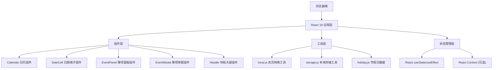

## 1. 架构设计



## 2. 技术描述

- **前端框架**：React@18 + TypeScript
- **构建工具**：Vite@5
- **样式方案**：TailwindCSS@3 + CSS 变量
- **图标库**：Lucide React
- **字体**：Google Fonts - Noto Sans SC
- **数据存储**：LocalStorage 本地存储
- **部署方式**：纯静态页面

## 3. 项目结构

```
rili/
├── src/
│   ├── components/
│   │   ├── Calendar.tsx      # 日历主组件
│   │   ├── DateCell.tsx      # 日期格子组件
│   │   ├── EventPanel.tsx    # 事项面板组件
│   │   ├── EventModal.tsx    # 事项弹窗组件
│   │   └── Header.tsx        # 头部导航组件
│   ├── utils/
│   │   ├── lunar.ts          # 农历转换工具
│   │   ├── holiday.ts        # 节假日数据
│   │   └── storage.ts        # 本地存储工具
│   ├── types/
│   │   └── index.ts          # 类型定义
│   ├── App.tsx               # 主应用组件
│   ├── main.tsx              # 入口文件
│   └── index.css             # 全局样式
├── index.html
├── package.json
├── vite.config.ts
├── tsconfig.json
└── tailwind.config.js
```

## 4. 类型定义

```typescript
// 事项类型
interface CalendarEvent {
  id: string;
  title: string;
  date: string; // YYYY-MM-DD
  time?: string;
  description?: string;
  createdAt: string;
}

// 日期信息类型
interface DateInfo {
  date: Date;
  year: number;
  month: number;
  day: number;
  weekDay: number;
  isToday: boolean;
  isCurrentMonth: boolean;
  lunar: {
    year: string;
    month: string;
    day: string;
    isLeap: boolean;
  };
  holiday?: string;
  lunarFestival?: string;
  solarFestival?: string;
}

// 日历状态类型
interface CalendarState {
  currentYear: number;
  currentMonth: number;
  selectedDate: Date | null;
  events: CalendarEvent[];
}
```

## 5. 数据模型

### 5.1 本地存储结构

```typescript
// localStorage 键名
const STORAGE_KEY = 'calendar_events';

// 存储格式
{
  "events": [
    {
      "id": "uuid-string",
      "title": "团队会议",
      "date": "2026-05-31",
      "time": "14:00",
      "description": "讨论项目进度",
      "createdAt": "2026-05-30T10:00:00.000Z"
    }
  ]
}
```

### 5.2 节假日数据结构

```typescript
interface HolidayData {
  solar: {
    [month: string]: {
      [day: string]: string; // 节日名称
    };
  };
  lunar: {
    [month: string]: {
      [day: string]: string; // 节日名称
    };
  };
  annual: {
    [year: string]: {
      [date: string]: string; // 每年变动的节假日（如春节）
    };
  };
}
```

## 6. 核心工具函数说明

### 6.1 农历转换工具 (lunar.ts)

- `solarToLunar(date: Date): LunarInfo` - 公历转农历
- `getLunarYearName(year: number): string` - 获取干支纪年
- `getLunarMonthName(month: number, isLeap: boolean): string` - 获取农历月份名
- `getLunarDayName(day: number): string` - 获取农历日期名

### 6.2 本地存储工具 (storage.ts)

- `getEvents(): CalendarEvent[]` - 获取所有事项
- `saveEvents(events: CalendarEvent[]): void` - 保存所有事项
- `addEvent(event: CalendarEvent): void` - 添加单个事项
- `updateEvent(id: string, event: Partial<CalendarEvent>): void` - 更新事项
- `deleteEvent(id: string): void` - 删除事项
- `getEventsByDate(date: string): CalendarEvent[]` - 获取指定日期的事项

### 6.3 日历生成逻辑

1. 根据年月计算当月第一天是星期几
2. 计算需要显示的上个月日期数量
3. 生成当月所有日期数据
4. 计算需要显示的下个月日期数量
5. 为每个日期添加上农历、节假日、星期等信息
