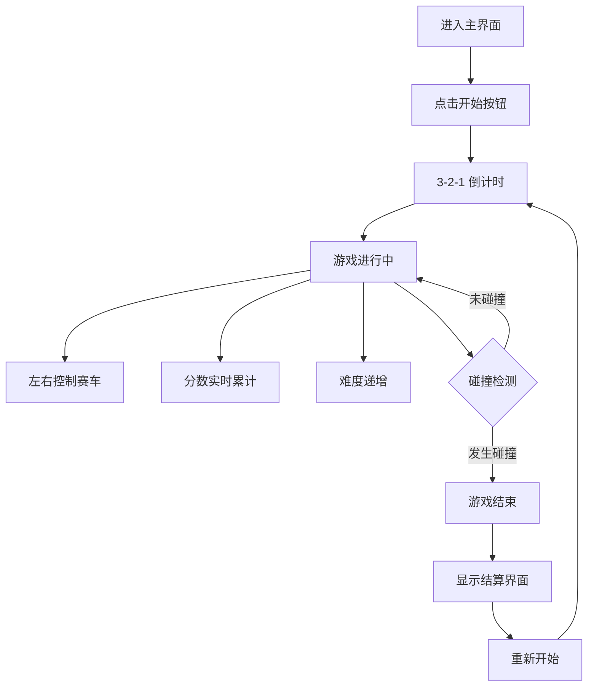

## 1. 产品概述
一款基于网页的赛车躲避游戏，玩家通过左右控制赛车躲避迎面而来的车流，坚持时间越久得分越高。采用伪3D透视道路视角，营造沉浸式驾驶体验。
- 核心玩法：键盘/触摸左右移动躲避障碍，生存计分机制
- 目标用户：休闲游戏玩家，碎片化时间娱乐

## 2. 核心功能

### 2.1 功能模块
1. **主界面**：游戏标题、开始按钮、最高分展示
2. **游戏场景**：伪3D道路、玩家赛车、AI车流、道路标线动画
3. **计分系统**：实时分数、最高分（localStorage持久化）
4. **碰撞检测**：精确碰撞判定、游戏结束动画
5. **难度递增**：随时间提升车速和车流密度

### 2.2 页面详情
| 页面名称 | 模块名称 | 功能描述 |
|-----------|-------------|---------------------|
| 主界面 | 标题区域 | 霓虹风格游戏LOGO、动画效果 |
| 主界面 | 开始按钮 | 3D立体按钮、悬停动效、点击进入游戏 |
| 主界面 | 最高分展示 | 历史最高分醒目标示 |
| 游戏界面 | 道路渲染 | 伪3D透视道路、车道分隔线流动效果 |
| 游戏界面 | 玩家车辆 | 左右键/触摸控制、平滑移动、限定车道范围 |
| 游戏界面 | 敌车系统 | 随机车道生成、多色车型、向下移动 |
| 游戏界面 | 计分面板 | 实时分数显示、速度等级指示 |
| 游戏界面 | 暂停功能 | 空格键暂停/继续 |
| 结束界面 | 结算弹窗 | 最终得分、历史最高、重新开始按钮 |

## 3. 核心流程
用户进入游戏 → 点击开始按钮 → 321倒计时 → 控制赛车左右躲避 → 分数随时间累计 → 难度逐步提升 → 碰撞触发结束 → 显示结算并可重开

## 4. 用户界面设计

### 4.1 设计风格
- **主色调**：深邃夜空蓝(#0a0a1a) + 霓虹粉(#ff2a6d) + 电光青(#05d9e8) + 警示黄(#f9c80e)
- **按钮风格**：3D立体悬浮按钮，霓虹边框发光效果，圆角设计
- **字体**：主标题使用Orbitron（未来科技感），正文使用Rajdhani（运动感）
- **布局**：全屏沉浸式画布，UI层叠于画布之上
- **视觉效果**：辉光、模糊、扫描线、速度线动效

### 4.2 页面设计概览
| 页面名称 | 模块名称 | UI元素 |
|-----------|-------------|-------------|
| 主界面 | 标题区域 | 大尺寸霓虹LOGO、上下浮动动画、光晕扩散 |
| 主界面 | 开始按钮 | 渐变色填充、悬停放大+发光、脉冲动画 |
| 主界面 | 最高分 | 金色边框卡片、闪烁星点装饰 |
| 游戏界面 | 道路 | 伪3D透视、动态车道线、路边反光柱 |
| 游戏界面 | 玩家车辆 | 红色霓虹车身、尾焰粒子特效、悬浮阴影 |
| 游戏界面 | 敌车 | 多色随机、大小差异、流动光影 |
| 游戏界面 | HUD | 半透明玻璃面板、实时分数、速度条、暂停按钮 |
| 结束界面 | 弹窗 | 毛玻璃效果、爆炸粒子、重新开始按钮 |

### 4.3 响应式设计
- 桌面端：键盘左右方向键/A D控制，空格暂停
- 移动端：屏幕左右区域触摸控制，自适应全屏
- 画布按比例缩放，保持游戏体验一致

### 4.4 视觉特效
- **环境氛围**：渐变背景模拟远景天空、星点点缀
- **道路效果**：透视消失点、车道线流动、路肩闪烁
- **车辆特效**：玩家尾焰粒子、敌车阴影、速度线
- **碰撞效果**：屏幕震动、爆炸粒子、红屏闪烁
- **UI动效**：倒计时缩放、分数跳动、按钮悬停
