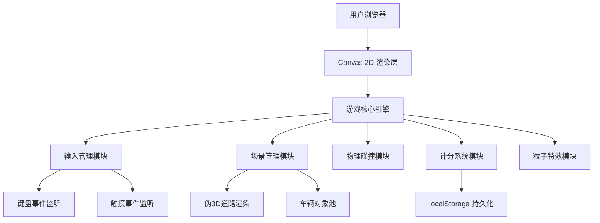

## 1. 架构设计



## 2. 技术描述
- **前端框架**：React@18 + TypeScript
- **构建工具**：Vite@5
- **样式方案**：TailwindCSS@3 + 自定义CSS动画
- **渲染技术**：原生 Canvas 2D API（无需额外游戏引擎，轻量高性能）
- **状态管理**：React useState + useRef（游戏循环用ref避免闭包问题）
- **字体方案**：Google Fonts（Orbitron + Rajdhani）
- **无后端、无数据库**：最高分使用localStorage本地存储

## 3. 路由定义
| 路由 | 用途 |
|-------|---------|
| / | 游戏主页面（包含所有状态：主菜单/游戏中/结束） |

## 4. 核心模块设计

### 4.1 游戏引擎类 (GameEngine)
- **gameLoop()**: requestAnimationFrame驱动的主循环
- **update(deltaTime)**: 更新所有游戏对象状态
- **render(ctx)**: 调用各模块渲染方法
- **start() / stop() / reset()**: 生命周期控制

### 4.2 伪3D道路渲染
- 采用透视投影原理：远近距离 = 1 / z
- 道路宽度随距离收缩，形成消失点
- 车道线分段绘制，模拟运动感
- 路肩反光柱周期出现

### 4.3 车辆对象池
- 玩家车辆：x轴位置、y轴固定、移动插值平滑
- 敌车数组：预分配对象池，复用避免GC
- 车道计算：3条固定车道，随机生成位置
- 速度系统：基础速度 + 时间增量，上限封顶

### 4.4 碰撞检测
- AABB矩形碰撞（简化，性能优先）
- 碰撞前预警帧检测，降低穿模
- 碰撞触发：屏幕震动 + 粒子爆炸 + 游戏状态切换

### 4.5 粒子系统
- 尾焰粒子：玩家车辆后方周期发射
- 爆炸粒子：碰撞时放射状扩散
- 路面尘土：敌车驶过时的小颗粒

## 5. 性能优化
- **对象池复用**：敌车、粒子不频繁创建销毁
- **分层渲染**：静态背景缓存至离屏canvas
- **deltaTime归一化**：不同帧率下速度一致
- **可见性裁剪**：屏幕外敌车跳过渲染
- **requestAnimationFrame**：利用浏览器渲染节奏

## 6. 文件结构
```
saiche/
├── src/
│   ├── App.tsx                 # 主组件，状态管理
│   ├── components/
│   │   ├── GameCanvas.tsx      # Canvas容器
│   │   ├── MainMenu.tsx        # 主菜单UI
│   │   ├── GameHUD.tsx         # 游戏内HUD
│   │   └── GameOver.tsx        # 结束弹窗
│   ├── game/
│   │   ├── GameEngine.ts       # 游戏引擎核心
│   │   ├── RoadRenderer.ts     # 伪3D道路渲染
│   │   ├── CarManager.ts       # 车辆管理
│   │   ├── ParticleSystem.ts   # 粒子系统
│   │   ├── Collision.ts        # 碰撞检测
│   │   └── types.ts            # 类型定义
│   ├── hooks/
│   │   └── useGameLoop.ts      # 游戏循环Hook
│   ├── styles/
│   │   └── index.css           # 全局样式+动画
│   └── main.tsx                # 入口
├── index.html
├── package.json
├── tailwind.config.js
├── vite.config.ts
└── tsconfig.json
```
