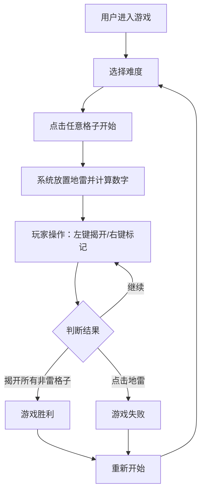

## 1. 产品概述

经典扫雷游戏的网页版本，玩家通过点击格子避开地雷，数字提示周围雷数。支持多种难度级别、计时器、旗帜标记等核心功能。
- 主要用途：休闲益智游戏，帮助用户锻炼逻辑推理能力
- 目标用户：喜欢经典益智游戏的玩家

## 2. 核心功能

### 2.1 用户角色
无需用户注册，所有访客直接开始游戏。

### 2.2 功能模块
1. **游戏主页面**：难度选择、游戏棋盘、状态栏、计时器、地雷计数器

### 2.3 页面详情
| 页面名称 | 模块名称 | 功能描述 |
|-----------|-------------|---------------------|
| 游戏主页面 | 难度选择 | 初级(9x9,10雷)、中级(16x16,40雷)、高级(30x16,99雷) |
| 游戏主页面 | 游戏棋盘 | 可点击的格子矩阵，左键揭开，右键标记旗帜 |
| 游戏主页面 | 状态栏 | 显示剩余地雷数、游戏状态表情、重新开始按钮 |
| 游戏主页面 | 计时器 | 游戏开始后自动计时，显示已用秒数 |

## 3. 核心流程

用户进入游戏 → 选择难度（默认初级）→ 点击任意格子开始游戏 → 系统放置地雷并计算数字 → 玩家通过左键揭开格子、右键标记旗帜 → 揭开所有非雷格子获胜 / 点击地雷游戏失败 → 点击重新开始按钮重新游戏

## 4. 用户界面设计

### 4.1 设计风格
- **主色调**：深灰蓝色背景 (#1e293b)，搭配经典扫雷灰 (#c0c0c0) 的棋盘区域
- **辅助色**：红色 (#ef4444) 表示地雷和失败状态，绿色 (#22c55e) 表示胜利，蓝色系列表示数字1-8
- **按钮风格**：3D立体效果，带有内阴影和外阴影的复古按钮风格
- **字体**：'Press Start 2P' 复古像素字体用于标题和数字，搭配现代无衬线字体
- **布局风格**：居中卡片式布局，棋盘区域有立体边框效果
- **图标**：使用 Emoji 图标（💣 地雷、🚩 旗帜、😊 正常状态、😎 胜利、😵 失败）

### 4.2 页面设计概述
| 页面名称 | 模块名称 | UI 元素 |
|-----------|-------------|-------------|
| 游戏主页面 | 难度选择 | 三个立体按钮，选中状态高亮显示 |
| 游戏主页面 | 游戏棋盘 | 格子矩阵，每个格子带有 3D 凸起效果，揭开后显示数字或雷 |
| 游戏主页面 | 状态栏 | LED数字风格的计数器，中间为表情按钮 |
| 游戏主页面 | 整体布局 | 深色渐变背景，居中游戏区域，带有阴影和圆角的卡片效果 |

### 4.3 响应性
- 桌面端优先设计，棋盘格子固定大小
- 移动端自适应，根据屏幕宽度调整格子大小
- 触屏设备支持长按标记旗帜
