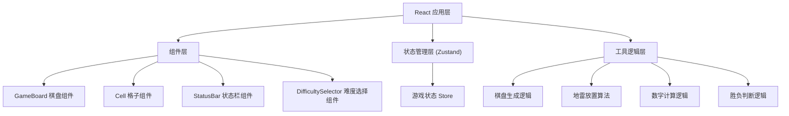

## 1. 架构设计

纯前端单页应用，使用 React 组件化开发，Zustand 管理游戏状态。



## 2. 技术描述
- **前端框架**：React@18 + TypeScript
- **构建工具**：Vite
- **样式方案**：Tailwind CSS 3
- **状态管理**：Zustand
- **图标库**：lucide-react
- **路由**：无需路由，单页面应用

## 3. 核心数据结构

### 3.1 格子类型定义
```typescript
interface Cell {
  row: number;
  col: number;
  isMine: boolean;
  isRevealed: boolean;
  isFlagged: boolean;
  adjacentMines: number;
}
```

### 3.2 难度配置
```typescript
interface Difficulty {
  name: string;
  rows: number;
  cols: number;
  mines: number;
}
```

### 3.3 游戏状态
```typescript
type GameStatus = 'idle' | 'playing' | 'won' | 'lost';

interface GameState {
  board: Cell[][];
  status: GameStatus;
  difficulty: Difficulty;
  minesLeft: number;
  timeElapsed: number;
  firstClick: boolean;
}
```

## 4. 核心算法

### 4.1 棋盘生成
- 初始化 rows × cols 的二维数组，所有格子初始状态为未揭开、非雷、非标记
- 首次点击后，在非首次点击位置随机放置指定数量的地雷
- 计算每个非雷格子周围8个方向的地雷数量

### 4.2 连锁揭开
- 当点击的格子周围没有地雷（adjacentMines === 0）时，递归揭开周围所有相邻格子
- 使用 BFS 或 DFS 算法避免栈溢出

### 4.3 胜负判断
- 胜利条件：所有非雷格子都被揭开
- 失败条件：点击到地雷格子
