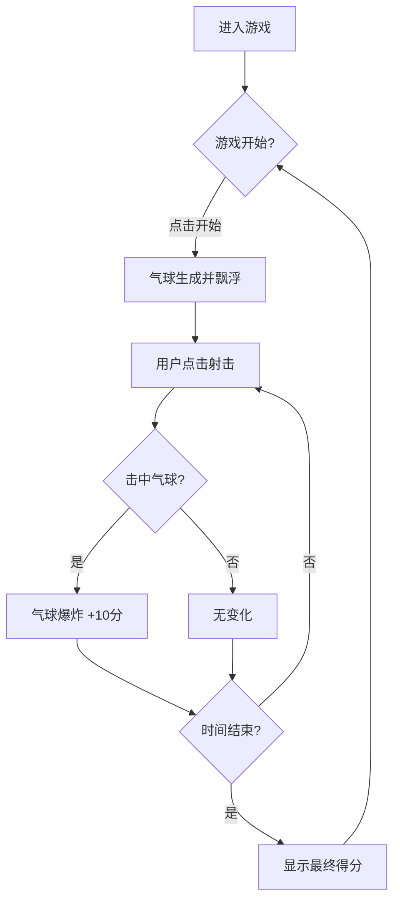

## 1. Product Overview
一个趣味性射击气球游戏，玩家通过点击屏幕瞄准并射击飘浮的气球，在60秒限时内获取最高分数。
- 主要目的：提供休闲娱乐，锻炼玩家反应能力
- 目标用户：所有年龄段的休闲游戏爱好者

## 2. Core Features

### 2.2 Feature Module
1. **游戏主界面**: 气球飘浮区域、计分板、倒计时显示
2. **游戏控制系统**: 点击射击、气球生成与移动

### 2.3 Page Details
| Page Name | Module Name | Feature description |
|-----------|-------------|---------------------|
| 游戏主界面 | 气球系统 | 随机生成彩色气球，向上飘浮，点击爆炸得分 |
| 游戏主界面 | 计分系统 | 实时显示当前得分，击中气球+10分 |
| 游戏主界面 | 倒计时系统 | 60秒倒计时，时间结束显示最终得分 |
| 游戏主界面 | 开始/重新开始 | 游戏开始和重新开始按钮 |

## 3. Core Process
用户进入游戏 -> 点击开始按钮 -> 气球开始飘浮 -> 用户点击气球射击 -> 击中得分 -> 60秒后游戏结束 -> 显示最终得分 -> 可重新开始

## 4. User Interface Design
### 4.1 Design Style
- 主色调：天空蓝背景，彩色气球（红、黄、蓝、绿、紫、橙）
- 按钮样式：圆润可爱风格，渐变色彩
- 字体：活泼卡通字体
- 布局：全屏游戏区域，顶部显示计分和倒计时

### 4.2 Page Design Overview
| Page Name | Module Name | UI Elements |
|-----------|-------------|-------------|
| 游戏主界面 | 背景 | 渐变天空蓝色，云朵装饰 |
| 游戏主界面 | 气球 | 多种颜色圆形气球，带高光效果 |
| 游戏主界面 | 计分板 | 左上角显示当前分数 |
| 游戏主界面 | 倒计时 | 右上角显示剩余时间 |
| 游戏主界面 | 按钮 | 开始/重新开始按钮，游戏结束遮罩 |

### 4.3 Responsiveness
- 自适应屏幕尺寸
- 移动端触摸优化

### 4.4 Animation
- 气球飘浮动画（上下轻微摆动）
- 气球爆炸动画（粒子效果）
- 得分弹出动画