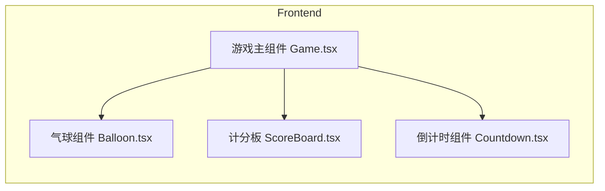

## 1. Architecture Design


## 2. Technology Description
- Frontend: React@18 + TypeScript + tailwindcss@3 + vite
- Initialization Tool: vite-init
- Backend: None (纯前端游戏)

## 3. Route Definitions
| Route | Purpose |
|-------|---------|
| / | 游戏主页面 |

## 4. Core Components
| Component | File Path | Description |
|-----------|-----------|-------------|
| Game | src/components/Game.tsx | 游戏主逻辑，管理气球状态、计分、倒计时 |
| Balloon | src/components/Balloon.tsx | 单个气球组件，显示和动画 |
| ScoreBoard | src/components/ScoreBoard.tsx | 分数显示 |
| Countdown | src/components/Countdown.tsx | 倒计时显示 |

## 5. Data Structures
```typescript
interface Balloon {
  id: string;
  x: number;
  y: number;
  color: string;
  size: number;
  speed: number;
  wobble: number;
}

interface GameState {
  score: number;
  timeLeft: number;
  balloons: Balloon[];
  isPlaying: boolean;
}
```

## 6. Game Logic
- 气球颜色列表：['#FF6B6B', '#FFE66D', '#4ECDC4', '#45B7D1', '#96CEB4', '#FF8E72']
- 气球生成：每1-2秒随机生成一个气球
- 气球移动：向上浮动，同时左右轻微摆动
- 点击检测：检测点击位置是否在气球范围内
- 得分规则：击中气球+10分
- 倒计时：60秒游戏时长