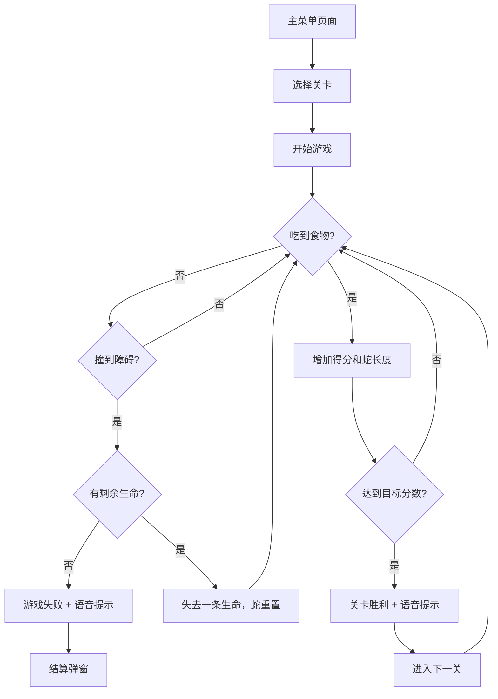

## 1. 产品概述

一款界面清新、具有关卡难度递进系统和语音提示功能的网页版贪吃蛇游戏。面向休闲游戏玩家，提供轻松愉悦的游戏体验，通过渐进式难度挑战玩家的反应速度和策略思维。

## 2. 核心功能

### 2.1 用户角色

| 角色 | 注册方式 | 核心权限 |
|------|----------|----------|
| 普通玩家 | 无需注册 | 开始游戏、选择关卡、查看得分 |

### 2.2 功能模块

1. **主菜单页面**：游戏标题、开始按钮、关卡选择、操作说明
2. **游戏画面**：游戏区域、实时得分、当前关卡、剩余生命、暂停按钮
3. **结算弹窗**：最终得分、通关/失败提示、再玩一次/返回主菜单按钮

### 2.3 页面详情

| 页面名称 | 模块名称 | 功能描述 |
|----------|----------|----------|
| 主菜单 | 游戏标题 | 展示带有动效的游戏Logo和标题 |
| 主菜单 | 关卡选择 | 展示1-10关，已解锁关卡可点击，未解锁关卡显示锁定状态 |
| 主菜单 | 开始按钮 | 从当前选中关卡开始游戏 |
| 主菜单 | 操作说明 | 展示键盘和触屏操作方式 |
| 游戏画面 | 游戏区域 | Canvas渲染的蛇、食物、障碍物 |
| 游戏画面 | 状态面板 | 显示得分、关卡、剩余生命、最高分 |
| 游戏画面 | 暂停按钮 | 暂停/继续游戏 |
| 结算弹窗 | 结果展示 | 胜利/失败动画，最终得分，语音提示 |
| 结算弹窗 | 操作按钮 | 再玩一次、下一关（胜利时）、返回主菜单 |

## 3. 核心流程

玩家从主菜单选择关卡 → 进入游戏画面 → 通过方向键或触屏控制蛇移动 → 吃到食物得分并增长 → 避开墙壁、障碍物和自身 → 达到目标分数进入下一关 → 撞墙或撞到自己则游戏失败。

## 4. 用户界面设计

### 4.1 设计风格

- **主色调**：清新薄荷绿 (#4ade80) 作为主色，天空蓝 (#38bdf8) 作为辅助色，搭配柔和的米白背景
- **点缀色**：暖橙色 (#fb923c) 用于食物和强调元素
- **按钮风格**：圆角胶囊按钮，带有轻微悬浮阴影和按压动画
- **字体**：使用 Google Fonts 的 "Nunito" 圆润无衬线字体
- **布局风格**：卡片式布局，柔和圆角，细腻阴影
- **图标风格**：使用 Emoji 和简单 SVG 图标，保持清新可爱风格

### 4.2 页面设计概览

| 页面名称 | 模块名称 | UI 元素 |
|----------|----------|----------|
| 主菜单 | 游戏标题 | 大号渐变彩色文字，带轻微弹跳动画 |
| 主菜单 | 关卡选择 | 圆角网格卡片，已解锁显示绿色，未解锁灰色带锁图标 |
| 主菜单 | 开始按钮 | 大号绿色胶囊按钮，悬浮放大效果 |
| 游戏画面 | 游戏区域 | 浅绿格子背景，蛇身渐变绿色，食物橙色圆形带光晕 |
| 游戏画面 | 状态面板 | 顶部半透明白色卡片，显示各数据项 |
| 结算弹窗 | 结果展示 | 居中模态框，胜利时绿色烟花动效，失败时柔和灰色 |

### 4.3 响应式设计

采用桌面端优先设计，同时适配移动端：
- 桌面端：游戏区域 600x600px，侧边显示状态面板
- 平板端：游戏区域自适应屏幕宽度
- 手机端：游戏区域全屏显示，状态面板在顶部，支持触屏滑动操作

### 4.4 视觉动效

- 页面加载时元素依次淡入
- 蛇身移动时丝滑过渡动画
- 吃食物时食物爆破粒子效果
- 关卡胜利时烟花绽放动画
- 按钮悬浮和点击微交互
