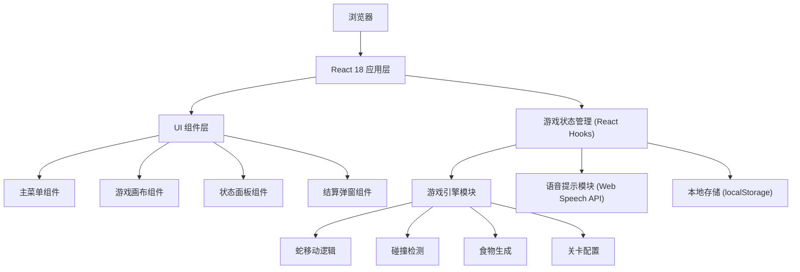

## 1. 架构设计



## 2. 技术说明

- **前端框架**：React@18 + Vite@5
- **样式方案**：TailwindCSS@3
- **游戏渲染**：HTML5 Canvas API
- **语音提示**：浏览器原生 Web Speech API (SpeechSynthesis)
- **状态管理**：React Hooks (useState, useEffect, useRef, useCallback)
- **数据持久化**：localStorage (存储最高分和关卡解锁进度)
- **后端**：无，纯前端单页应用

## 3. 路由定义

| 路由 | 用途 |
|------|------|
| / | 主页面，包含游戏全部内容（单页应用内通过状态切换视图） |

## 4. 核心模块说明

### 4.1 游戏引擎模块

```typescript
// 方向枚举
type Direction = 'UP' | 'DOWN' | 'LEFT' | 'RIGHT';

// 坐标点
interface Point {
  x: number;
  y: number;
}

// 关卡配置
interface LevelConfig {
  level: number;
  speed: number;           // 蛇移动速度 (ms/格)
  targetScore: number;     // 通关目标分数
  obstacles: Point[];      // 障碍物坐标
  gridSize: number;        // 网格大小
  lives: number;           // 生命值
}

// 游戏状态
interface GameState {
  snake: Point[];
  food: Point;
  direction: Direction;
  nextDirection: Direction;
  score: number;
  level: number;
  lives: number;
  isPlaying: boolean;
  isPaused: boolean;
  isGameOver: boolean;
  isVictory: boolean;
  highScore: number;
  unlockedLevels: number[];
}
```

### 4.2 关卡难度设计

| 关卡 | 速度(ms) | 目标分数 | 障碍物数量 | 网格大小 | 生命值 |
|------|----------|----------|------------|----------|--------|
| 1 | 200 | 50 | 0 | 20x20 | 3 |
| 2 | 180 | 80 | 2 | 20x20 | 3 |
| 3 | 160 | 120 | 4 | 20x20 | 3 |
| 4 | 140 | 160 | 6 | 20x20 | 2 |
| 5 | 120 | 200 | 8 | 22x22 | 2 |
| 6 | 100 | 260 | 10 | 22x22 | 2 |
| 7 | 90 | 320 | 14 | 24x24 | 2 |
| 8 | 80 | 400 | 18 | 24x24 | 1 |
| 9 | 70 | 500 | 24 | 26x26 | 1 |
| 10 | 60 | 650 | 30 | 26x26 | 1 |

### 4.3 语音提示模块

使用 Web Speech API 实现语音播报：
- 游戏开始："第 X 关，开始！"
- 吃到食物：简短音效（可选语音）
- 关卡胜利："恭喜通关！"
- 失去生命："小心！"
- 游戏失败："游戏结束"
- 暂停/继续："游戏暂停"/"继续游戏"

## 5. 组件结构

```
src/
├── components/
│   ├── MainMenu.tsx       # 主菜单（标题、关卡选择、开始按钮）
│   ├── GameCanvas.tsx     # Canvas 游戏画布
│   ├── StatusPanel.tsx    # 状态面板（得分、关卡、生命）
│   └── ResultModal.tsx    # 结算弹窗（胜利/失败）
├── hooks/
│   └── useGameEngine.ts   # 游戏引擎核心逻辑 Hook
├── utils/
│   ├── levels.ts          # 关卡配置
│   ├── speech.ts          # 语音提示工具
│   └── storage.ts         # 本地存储工具
├── App.tsx                # 主应用组件
├── main.tsx               # 入口文件
└── index.css              # 全局样式
```

## 6. 数据模型

### 6.1 本地存储数据结构

```typescript
// localStorage key: 'snake_game_data'
interface StorageData {
  highScore: number;
  unlockedLevels: number[];  // 已解锁的关卡编号数组
  lastPlayedLevel: number;
}
```
