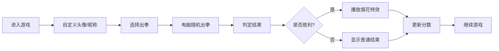

## 1. 产品概述
石头剪刀布人机对战小游戏，提供休闲娱乐体验，支持个性化设置和胜利庆祝效果。
- 主要目的：提供简单有趣的人机对战体验，支持用户自定义头像和昵称
- 目标用户：所有年龄段的休闲游戏玩家

## 2. 核心功能

### 2.1 用户角色
| 角色 | 注册方式 | 核心权限 |
|------|----------|----------|
| 玩家 | 无需注册，直接使用 | 自定义头像和昵称、进行游戏、查看对战结果 |

### 2.2 功能模块
1. **游戏主界面**: 用户信息区、对战区、选择操作区、分数统计
2. **个性化设置**: 头像更换、昵称修改
3. **胜利庆祝**: 烟花特效、胜利字样动画

### 2.3 页面详情
| 页面名称 | 模块名称 | 功能描述 |
|----------|----------|----------|
| 游戏主页面 | 用户信息区 | 显示玩家头像、昵称、分数；支持点击编辑 |
| 游戏主页面 | 对战展示区 | 显示玩家和电脑的出拳选择，带动画效果 |
| 游戏主页面 | 操作选择区 | 石头、剪刀、布三个选择按钮 |
| 游戏主页面 | 结果提示区 | 显示胜负结果、胜利烟花特效 |
| 游戏主页面 | 分数统计区 | 显示胜、负、平的次数统计 |

## 3. 核心流程
用户打开游戏 → 可选择更换头像和修改昵称 → 点击石头/剪刀/布进行游戏 → 电脑随机出拳 → 判定胜负 → 显示结果（胜利时播放烟花特效）→ 更新分数统计

## 4. 用户界面设计

### 4.1 设计风格
- 主色调：活力橙 (#FF6B35) 搭配 清新蓝 (#4ECDC4)
- 按钮风格：圆润3D按钮，带悬停和点击动效
- 字体：使用 Google Fonts 的 "Fredoka" 可爱风格字体
- 布局风格：卡片式布局，圆角设计，柔和阴影
- 图标风格：使用 emoji 作为游戏元素，活泼有趣

### 4.2 页面设计概述
| 页面名称 | 模块名称 | UI元素 |
|----------|----------|--------|
| 游戏主页面 | 用户信息区 | 圆形头像、可编辑昵称、分数徽章 |
| 游戏主页面 | 对战展示区 | 左右对称布局，玩家vs电脑，出拳动画 |
| 游戏主页面 | 操作选择区 | 三个大型圆形按钮，悬停放大效果 |
| 游戏主页面 | 胜利特效 | Canvas 烟花粒子效果，胜利字样缩放动画 |

### 4.3 响应式
- 桌面端优先设计，自适应移动端
- 触摸操作优化，按钮尺寸适合点击
- 响应式布局，在不同屏幕尺寸下保持良好体验
