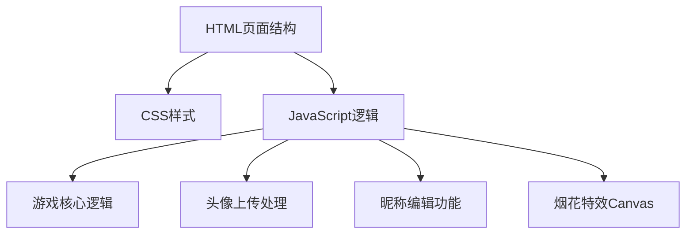

## 1. 架构设计


## 2. 技术描述
- 前端：纯 HTML5 + CSS3 + JavaScript (ES6+)
- 无后端依赖，纯前端实现
- 数据存储：localStorage 存储用户头像和昵称
- 特效：Canvas 实现烟花粒子效果

## 3. 文件结构
| 文件 | 用途 |
|------|------|
| index.html | 游戏主页面，包含所有HTML结构 |
| styles.css | 样式文件，包含所有CSS样式和动画 |
| script.js | 脚本文件，包含游戏逻辑和特效 |

## 4. 核心功能实现

### 4.1 游戏逻辑
```javascript
// 出拳选择
const choices = ['rock', 'paper', 'scissors'];

// 胜负判定规则
const rules = {
    rock: 'scissors',
    paper: 'rock',
    scissors: 'paper'
};

// 判定胜负函数
function determineWinner(player, computer) {
    if (player === computer) return 'draw';
    return rules[player] === computer ? 'win' : 'lose';
}
```

### 4.2 烟花特效
- 使用 Canvas 2D API 绘制粒子
- 粒子物理模拟（重力、速度衰减）
- 多种颜色随机变化
- 胜利字样缩放动画

### 4.3 头像上传
- 使用 FileReader API 读取本地图片
- 转换为 base64 存储到 localStorage
- 支持图片预览和裁剪（简单实现）

### 4.4 数据持久化
- localStorage 存储：userName, userAvatar, scores
- 页面加载时自动恢复用户设置
