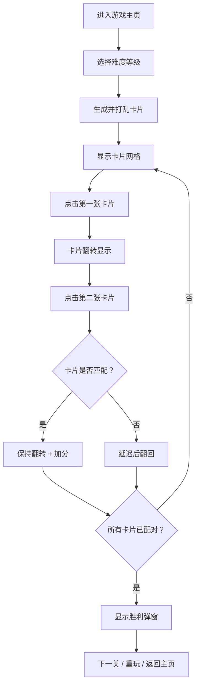

## 1. 产品概述

数字记忆配对游戏是一款经典的休闲益智游戏，玩家通过翻转卡片找出相同的数字/图案对来完成关卡。游戏适合所有年龄段用户，旨在锻炼记忆力和专注力。

- 主要目标：通过关卡递增难度，提供有趣的记忆力挑战体验
- 目标用户：休闲游戏爱好者、各年龄段玩家

## 2. 核心功能

### 2.1 功能模块

1. **游戏主界面**：卡片网格、计分板、计时显示、关卡选择
2. **卡片系统**：翻转动画、匹配检测、配对成功/失败反馈
3. **难度系统**：4x4、6x6、8x8网格逐步递增
4. **进度系统**：得分统计、用时统计、最佳记录

### 2.2 页面详情

| 页面名称 | 模块名称 | 功能描述 |
|-----------|-------------|---------------------|
| 游戏主页 | 难度选择区 | 展示三个难度等级（4x4/6x6/8x8），点击选择关卡 |
| 游戏主页 | 游戏网格区 | 卡片网格布局，支持点击翻转，3D翻转动画效果 |
| 游戏主页 | 状态栏 | 实时显示步数、用时、得分、已配对数 |
| 游戏主页 | 操作按钮 | 重新开始、返回主页、提示功能 |
| 游戏主页 | 胜利弹窗 | 完成关卡后显示成绩，可进入下一关或重玩 |

## 3. 核心流程

玩家进入游戏后选择难度等级，系统随机生成配对卡片并打乱顺序。玩家依次点击两张卡片进行翻转：如果匹配成功则保持翻转状态并加分；如果匹配失败则短暂显示后自动翻回。当所有卡片都成功配对时，游戏胜利，显示最终成绩并可进入更高难度关卡。

## 4. 用户界面设计

### 4.1 设计风格

- **设计主题**：复古霓虹街机风格，深色背景配鲜艳霓虹色
- **主色调**：深紫蓝 (#0f0c29) 背景，霓虹青 (#00f5ff) 和霓虹粉 (#ff00ff) 为强调色
- **按钮风格**：圆角玻璃拟态按钮，带霓虹发光边框和悬停效果
- **字体**：展示字体使用 Press Start 2P（像素风），正文字体使用 JetBrains Mono
- **布局风格**：居中卡片式布局，网格对称对齐
- **图标风格**：使用 emoji 数字与几何图案

### 4.2 页面设计概述

| 页面名称 | 模块名称 | UI元素 |
|-----------|-------------|-------------|
| 游戏主页 | 难度选择区 | 三张霓虹风格卡片，Hover浮动动画，点击缩放效果 |
| 游戏主页 | 游戏网格区 | 3D翻转卡片（CSS transform），匹配成功发光效果，失败抖动动画 |
| 游戏主页 | 状态栏 | 霓虹发光数字显示，像素风标签 |
| 游戏主页 | 操作按钮 | 玻璃拟态按钮，霓虹边框，悬停发光 |
| 游戏主页 | 胜利弹窗 | 渐变背景弹窗，星级评分，彩带粒子动画 |

### 4.3 响应式设计

- 桌面端为主：网格居中显示，卡片大小根据难度自适应
- 移动端适配：媒体查询调整卡片尺寸和间距，确保可点击区域充足
- 触摸优化：增大触摸区域，移除仅hover效果，添加触感反馈
