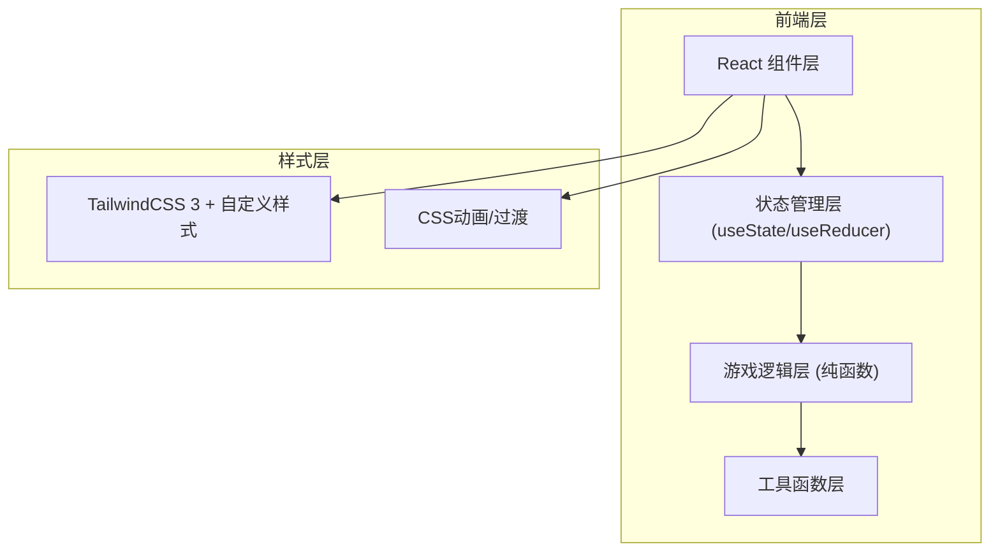

## 1. 架构设计



## 2. 技术说明

- **前端框架**：React@18 + Vite@5
- **样式方案**：TailwindCSS@3 + 自定义CSS动画
- **初始化工具**：vite-init (npm create vite@latest)
- **后端**：无（纯前端游戏）
- **数据持久化**：localStorage 存储最佳成绩

## 3. 路由定义

| 路由 | 用途 |
|-------|---------|
| / | 游戏主页（包含难度选择和游戏界面） |

本游戏为单页应用，通过状态切换显示不同视图（难度选择 / 游戏中 / 胜利）。

## 4. 组件结构

```
src/
├── components/
│   ├── GameBoard.jsx       # 游戏网格主组件
│   ├── Card.jsx            # 单张卡片组件（含翻转动画）
│   ├── DifficultySelect.jsx # 难度选择界面
│   ├── StatusBar.jsx       # 状态栏（步数/用时/得分）
│   ├── VictoryModal.jsx    # 胜利弹窗
│   └── ActionButtons.jsx   # 操作按钮组
├── hooks/
│   └── useGameLogic.js     # 游戏核心逻辑hook
├── utils/
│   ├── cardGenerator.js    # 卡片生成与打乱工具
│   └── formatters.js       # 时间/分数格式化
├── App.jsx
├── main.jsx
└── index.css
```

## 5. 数据模型

### 5.1 卡片数据结构

```javascript
{
  id: number,          // 唯一标识
  pairId: number,      // 配对ID（相同pairId为一对）
  content: string,     // 显示内容（数字或emoji）
  isFlipped: boolean,  // 是否正面朝上
  isMatched: boolean,  // 是否已成功配对
}
```

### 5.2 游戏状态

```javascript
{
  difficulty: '4x4' | '6x6' | '8x8',
  cards: Card[],
  selectedCards: number[],  // 当前选中的卡片索引（最多2张）
  moves: number,
  matches: number,
  score: number,
  startTime: number | null,
  elapsedTime: number,
  gameStatus: 'selecting' | 'playing' | 'victory',
}
```

## 6. 核心游戏逻辑

1. **卡片生成**：根据难度生成N对卡片，内容从预设数组中选取，Fisher-Yates洗牌
2. **翻转逻辑**：每次最多选2张，选中期间禁用其他卡片点击
3. **匹配判断**：两张卡片pairId相同即为匹配成功
4. **计分规则**：基础分 + 时间奖励 + 步数奖励，匹配成功加分，失败扣分
5. **胜利条件**：所有卡片isMatched为true
