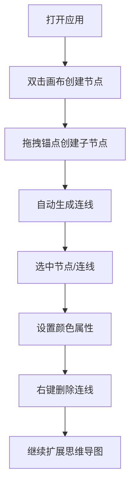

## 1. 产品概述

在线思维导图工具，支持通过鼠标交互创建节点、建立连线、右键删除连线，并可自定义节点和连线的颜色。适用于知识整理、头脑风暴、项目规划等场景，帮助用户以可视化方式组织和展示思想。

## 2. 核心功能

### 2.1 用户角色
| 角色 | 注册方式 | 核心权限 |
|------|----------|----------|
| 普通用户 | 无需注册 | 创建、编辑、删除思维导图节点和连线 |

### 2.2 功能模块
1. **主画布页面**：无限画布、节点管理、连线管理、工具栏、属性面板

### 2.3 页面详情
| 页面名称 | 模块名称 | 功能描述 |
|----------|----------|----------|
| 主画布页面 | 无限画布 | 支持拖拽平移、缩放、网格背景 |
| 主画布页面 | 节点管理 | 双击创建节点、拖拽移动、编辑文本 |
| 主画布页面 | 连线管理 | 从节点锚点拖拽创建连线、右键删除连线 |
| 主画布页面 | 工具栏 | 清除画布、导出功能、操作指引 |
| 主画布页面 | 属性面板 | 选中节点/连线后设置颜色等属性 |

## 3. 核心流程

用户打开应用 → 双击画布创建中心节点 → 拖拽节点边缘锚点创建子节点与连线 → 选中节点/连线 → 在属性面板设置颜色 → 右键点击连线删除 → 继续扩展思维导图结构。

## 4. 用户界面设计

### 4.1 设计风格
- **设计方向**：野兽派极简风格（Brutalist Minimalism），高对比度、粗线条、原始质感
- **主色调**：深炭灰背景 (#121212)，纯白节点边框 (#FFFFFF)，高亮霓虹青 (#00FFFF) 作为交互强调色
- **辅助色**：预设8种鲜明色彩供用户选择（红 #FF4444、橙 #FF8800、黄 #FFDD00、绿 #00CC66、青 #00FFFF、蓝 #3388FF、紫 #AA66FF、粉 #FF66AA）
- **按钮样式**：方形粗边框按钮，悬停时背景填充，按下时轻微内缩
- **字体**：显示字体使用 Space Mono（等宽 monospace 字体，科技感），正文使用 JetBrains Mono
- **布局**：画布居中，工具栏顶部固定，属性面板右侧抽屉式展开
- **视觉细节**：点阵网格背景、粗糙的节点边框、发光的选中效果、像素化的光标

### 4.2 页面设计概述
| 页面名称 | 模块名称 | UI 元素 |
|----------|----------|----------|
| 主画布页面 | 无限画布 | 点阵网格背景、平移拖拽、滚轮缩放、坐标显示 |
| 主画布页面 | 节点 | 圆角矩形、粗边框、可编辑文本、边缘锚点、选中发光效果 |
| 主画布页面 | 连线 | 贝塞尔曲线、箭头终点、可选中、颜色跟随节点或自定义 |
| 主画布页面 | 工具栏 | 左对齐、固定顶部、半透明磨砂背景、粗边框按钮组 |
| 主画布页面 | 属性面板 | 右侧滑出、色彩选择器网格、输入框、删除按钮 |
| 主画布页面 | 操作指引 | 首次加载时的简洁操作提示卡片 |

### 4.3 响应式
- 桌面端优先设计，画布区域自适应屏幕大小
- 工具栏在小屏幕自动折叠为图标按钮
- 属性面板在移动端改为底部弹出

### 4.4 交互与动画
- 节点创建：从点击位置缩放弹出 + 边框描边动画
- 连线创建：贝塞尔曲线跟随鼠标实时绘制
- 选中效果：边框发光脉冲动画
- 颜色切换：平滑的颜色过渡动画
- 面板滑出：从右侧滑入 + 背景遮罩淡入
