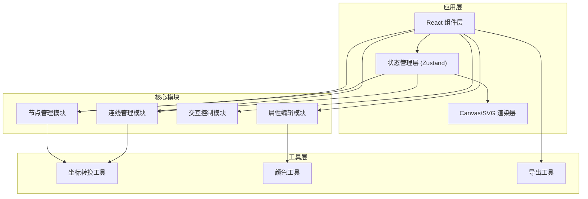
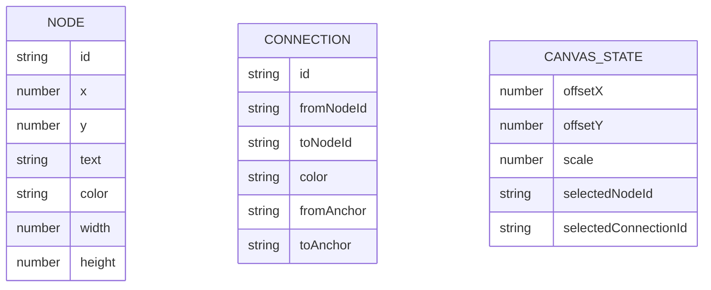

## 1. 架构设计

纯前端单页应用，无需后端服务，所有数据存储在浏览器内存中，支持导出为图片。



## 2. 技术描述

- **前端框架**：React@18 + TypeScript + Vite@5
- **样式方案**：TailwindCSS@3
- **状态管理**：Zustand
- **图标库**：lucide-react
- **渲染技术**：原生 SVG（便于节点和连线的交互操作）
- **构建工具**：Vite

## 3. 路由定义

| 路由 | 用途 |
|------|------|
| / | 主画布页面 |

## 4. 数据模型

### 4.1 数据结构定义



### 4.2 TypeScript 类型定义

```typescript
interface MindMapNode {
  id: string;
  x: number;
  y: number;
  text: string;
  color: string;
  width: number;
  height: number;
}

interface Connection {
  id: string;
  fromNodeId: string;
  toNodeId: string;
  color: string;
  fromAnchor: 'top' | 'right' | 'bottom' | 'left';
  toAnchor: 'top' | 'right' | 'bottom' | 'left';
}

interface CanvasState {
  offsetX: number;
  offsetY: number;
  scale: number;
  selectedNodeId: string | null;
  selectedConnectionId: string | null;
}

interface MindMapStore {
  nodes: MindMapNode[];
  connections: Connection[];
  canvas: CanvasState;
  addNode: (node: Omit<MindMapNode, 'id'>) => void;
  updateNode: (id: string, updates: Partial<MindMapNode>) => void;
  deleteNode: (id: string) => void;
  addConnection: (connection: Omit<Connection, 'id'>) => void;
  updateConnection: (id: string, updates: Partial<Connection>) => void;
  deleteConnection: (id: string) => void;
  setSelectedNode: (id: string | null) => void;
  setSelectedConnection: (id: string | null) => void;
  updateCanvas: (updates: Partial<CanvasState>) => void;
  clearAll: () => void;
}
```

## 5. 项目结构

```
src/
├── components/
│   ├── Canvas/
│   │   ├── MindMapCanvas.tsx      # 主画布组件
│   │   ├── MindMapNode.tsx        # 节点组件
│   │   ├── MindMapConnection.tsx  # 连线组件
│   │   └── AnchorPoint.tsx        # 锚点组件
│   ├── Toolbar/
│   │   └── Toolbar.tsx            # 顶部工具栏
│   └── PropertyPanel/
│       └── PropertyPanel.tsx      # 属性编辑面板
├── store/
│   └── useMindMapStore.ts         # Zustand 状态管理
├── utils/
│   ├── colors.ts                  # 颜色工具函数
│   ├── coordinates.ts             # 坐标转换工具
│   └── export.ts                  # 导出功能
├── types/
│   └── index.ts                   # 类型定义
├── App.tsx
├── main.tsx
└── index.css
```

## 6. 核心技术点

1. **SVG 渲染**：使用 SVG 绘制节点和连线，支持贝塞尔曲线和箭头标记
2. **坐标系统**：实现画布偏移 + 缩放的坐标转换
3. **拖拽交互**：节点拖拽、画布平移、锚点拖拽创建连线
4. **右键菜单**：原生 contextmenu 事件处理连线删除
5. **文本编辑**：contentEditable 实现节点内文本编辑
6. **颜色系统**：预设调色板 + 自定义颜色选择器
