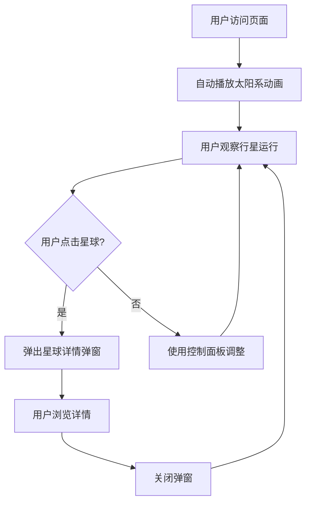

## 1. 产品概述
太空星球动态运行模拟系统是一个交互式天文科普可视化应用，通过生动的动画效果展示太阳系行星的运行轨迹，用户可以点击星球查看详细介绍。

- 主要目的：通过可视化方式普及天文知识，让用户直观了解太阳系行星的运行规律和基本信息
- 目标用户：天文爱好者、学生、教师以及对宇宙探索感兴趣的普通用户
- 产品价值：将抽象的天文知识转化为直观可交互的动态展示，提升学习趣味性

## 2. 核心功能

### 2.1 用户角色
| 角色 | 注册方式 | 核心权限 |
|------|----------|----------|
| 普通访客 | 无需注册 | 浏览星球运行动画、点击查看星球详情 |

### 2.2 功能模块
1. **主界面**：太空背景、星空动画、太阳系行星轨道系统
2. **行星运行模拟**：八大行星围绕太阳按比例轨道运行，速度可调节
3. **星球详情弹窗**：点击任意星球弹出详细介绍面板

### 2.3 页面详情
| 页面名称 | 模块名称 | 功能描述 |
|----------|----------|----------|
| 主界面 | 星空背景 | 动态闪烁的星星背景，营造深邃太空氛围 |
| 主界面 | 太阳系中心 | 太阳发光效果，作为轨道中心 |
| 主界面 | 行星轨道系统 | 八大行星按真实比例轨道环绕运行，带有运行轨迹线 |
| 主界面 | 控制面板 | 播放/暂停、速度调节、显示/隐藏轨道等控制功能 |
| 详情弹窗 | 星球信息展示 | 显示行星名称、直径、质量、公转周期、自转周期、温度、卫星数量等详细参数 |
| 详情弹窗 | 行星图片 | 展示行星高清图片 |
| 详情弹窗 | 描述介绍 | 行星基本特征和趣味知识介绍 |

## 3. 核心流程
用户打开页面后，自动开始播放太阳系运行动画。用户可以：
- 观察行星运行轨迹和相对速度
- 点击任意星球图标，弹出详情面板展示该星球的详细信息
- 使用控制面板调整动画播放状态
- 关闭详情弹窗继续浏览其他星球

## 4. 用户界面设计

### 4.1 设计风格
- **主色调**：深邃太空黑 (#0a0a1a) 作为背景，配合星空蓝 (#1a1a3e)、星尘紫 (#2d1b4e) 渐变
- **点缀色**：太阳橙黄 (#ffb347)、地球蓝 (#4da6ff)、火星红 (#ff6b4a) 等各行星代表色
- **字体**：标题使用 'Orbitron' 科幻字体，正文使用 'Rajdhani' 现代无衬线字体
- **视觉效果**：发光效果、模糊光晕、粒子动画，营造沉浸式太空体验
- **按钮样式**：半透明玻璃态按钮，带有霓虹边框发光效果
- **整体风格**：赛博朋克科幻风，深邃神秘的太空氛围

### 4.2 页面设计概述
| 页面名称 | 模块名称 | UI 元素 |
|----------|----------|----------|
| 主界面 | 星空背景 | 随机分布的闪烁星星、粒子漂浮效果、星云渐变 |
| 主界面 | 太阳系 | 中心发光太阳、同心圆轨道、按比例大小的行星、行星发光效果 |
| 主界面 | 控制面板 | 左下角固定位置、播放/暂停按钮、速度滑块、轨道显示开关 |
| 详情弹窗 | 弹窗面板 | 居中显示、毛玻璃背景、行星大图、信息卡片、关闭按钮 |
| 详情弹窗 | 信息展示 | 参数网格布局、进度条可视化、数据图标 |

### 4.3 响应式
- 桌面端优先设计，完整展示所有行星轨道和控制功能
- 平板端：自适应缩放，保持主要交互区域可用
- 移动端：简化轨道显示，优化弹窗布局，确保触控交互流畅

### 4.4 动画与交互
- **行星动画**：匀速圆周运动，各行星按真实公转周期比例调整速度
- **星星闪烁**：随机间隔的透明度变化动画
- **悬停效果**：鼠标悬停星球时放大并增强发光效果
- **弹窗动画**：缩放淡入效果，背景模糊变暗
- **过渡效果**：所有状态变化使用平滑的 CSS 过渡动画
