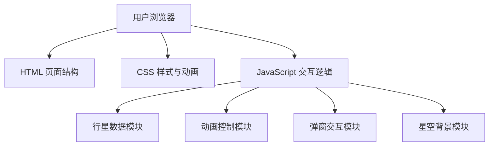

## 1. 架构设计
本项目采用纯前端实现，无需后端服务，所有数据本地存储。



## 2. 技术描述
- **前端技术栈**：纯 HTML5 + CSS3 + 原生 JavaScript (ES6+)
- **CSS 技术**：CSS 变量、CSS 动画 (@keyframes)、Flexbox 布局、Grid 布局、backdrop-filter 毛玻璃效果、box-shadow 发光效果
- **JavaScript 技术**：DOM 操作、requestAnimationFrame 动画、事件委托、模块化数据管理
- **字体**：Google Fonts 在线字体 (Orbitron, Rajdhani)
- **图片资源**：使用在线图片 API 生成行星图片

## 3. 目录结构
```
d:\workspace\treasolo\taikong\
├── index.html          # 主页面
├── css\
│   └── style.css       # 样式文件
├── js\
│   └── app.js          # 主逻辑脚本
└── .trae\
    └── documents\      # 项目文档
```

## 4. 数据模型

### 4.1 行星数据结构
```javascript
const planets = [
  {
    name: '水星',
    nameEn: 'Mercury',
    size: 8,           // 星球大小（像素）
    orbitRadius: 80,   // 轨道半径（像素）
    orbitSpeed: 4.74,  // 相对公转速度
    color: '#b5b5b5',  // 星球颜色
    glowColor: 'rgba(181, 181, 181, 0.6)',
    data: {
      diameter: '4,879 km',
      mass: '3.285 × 10²³ kg',
      orbitPeriod: '88 地球日',
      rotationPeriod: '58.6 地球日',
      temperature: '-173°C 至 427°C',
      moons: 0,
      description: '水星是太阳系中最小的行星，也是距离太阳最近的行星...'
    }
  },
  // ... 其他行星数据
];
```

### 4.2 星空粒子数据
```javascript
interface Star {
  x: number;        // X坐标
  y: number;        // Y坐标
  size: number;     // 星星大小
  opacity: number;  // 初始透明度
  twinkleSpeed: number; // 闪烁速度
}
```

## 5. 核心功能模块

### 5.1 动画控制模块
- 使用 `requestAnimationFrame` 实现流畅动画
- 支持播放/暂停状态切换
- 速度倍率调节（0.5x - 3x）
- 轨道显示/隐藏切换

### 5.2 行星轨道计算
- 基于三角函数计算行星位置：`x = centerX + radius * cos(angle)`，`y = centerY + radius * sin(angle)`
- 每帧更新角度：`angle += speed * timeDelta * speedMultiplier`
- 各行星速度按真实公转周期比例设定

### 5.3 弹窗交互模块
- 事件委托监听星球点击
- 点击时获取对应行星数据
- 动态渲染弹窗内容
- 支持 ESC 键和点击背景关闭

### 5.4 星空背景模块
- Canvas 绘制 200+ 随机星星
- 随机闪烁动画效果
- 流星偶尔划过效果

## 6. 性能优化
- 使用 `transform` 和 `opacity` 属性做动画，触发 GPU 加速
- 避免在动画循环中进行 DOM 查询
- 使用 CSS 变量统一管理颜色和动画参数
- 星空背景使用 Canvas 绘制，减少 DOM 节点数量
