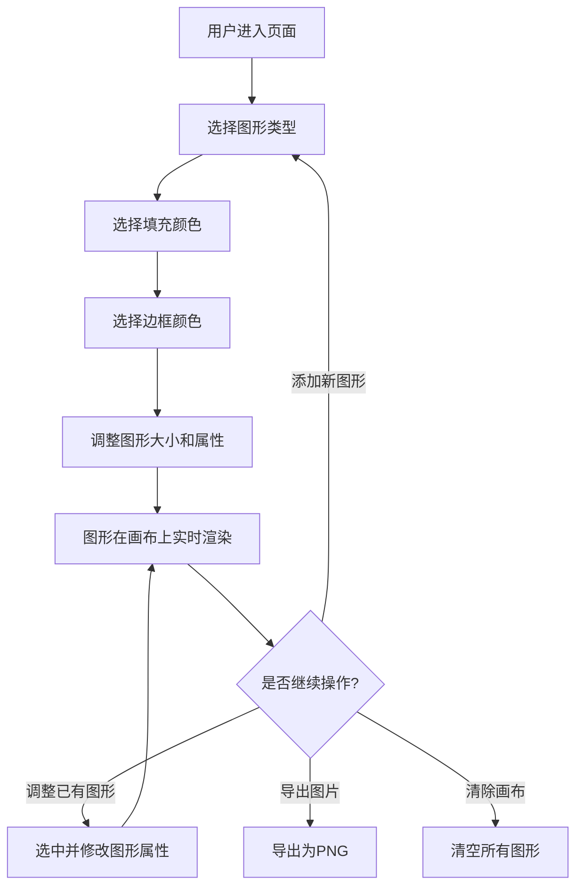

## 1. 产品概述

图形生成器是一个交互式 Web 应用，用户可以选择不同的图形类型（圆形、正方形、三角形、五边形、六边形、星形等），搭配自定义颜色，实时在画布上生成对应的图形。该应用面向设计师、开发者和普通用户，提供直观的图形创建体验。

## 2. 核心功能

### 2.1 用户角色

无需用户角色区分，所有用户均可自由使用。

### 2.2 功能模块

1. **主页面**：图形选择面板、颜色选择器、图形画布、操作控制区

### 2.3 页面详情

| 页面名称 | 模块名称 | 功能描述 |
|---------|---------|---------|
| 主页面 | 图形选择面板 | 提供多种图形类型供用户选择，包括圆形、正方形、矩形、三角形、五边形、六边形、星形、菱形 |
| 主页面 | 颜色选择器 | 提供预设颜色色板和自定义颜色输入，支持填充色和边框色分别设置 |
| 主页面 | 图形画布 | 实时渲染用户选择的图形，支持多图形叠加显示，可拖拽移动图形位置 |
| 主页面 | 操作控制区 | 支持调整图形大小、清除画布、撤销操作、导出图片 |
| 主页面 | 图形属性面板 | 显示当前选中图形的属性信息，支持调整透明度、旋转角度等 |

## 3. 核心流程

用户进入页面 → 从图形面板选择图形类型 → 选择填充颜色和边框颜色 → 调整图形大小和属性 → 图形在画布上实时渲染 → 可继续添加新图形或调整已有图形 → 支持导出或清除

## 4. 用户界面设计

### 4.1 设计风格

- 主色调：深色背景 (#0f0f1a) 搭配霓虹绿 (#00ff88) 强调色，辅以暗紫色 (#2a1a4e)
- 按钮风格：圆角玻璃拟态按钮，带有微光边框效果
- 字体：Outfit（标题） + DM Sans（正文）
- 布局风格：左侧控制面板 + 右侧画布区域，响应式布局
- 图标风格：线性图标，搭配霓虹发光效果

### 4.2 页面设计概述

| 页面名称 | 模块名称 | UI元素 |
|---------|---------|--------|
| 主页面 | 图形选择面板 | 网格布局的图形卡片，每个卡片展示图形预览缩略图，选中时带霓虹发光边框 |
| 主页面 | 颜色选择器 | 环形色板 + 色相滑块，预设色块快速选取，HEX输入框 |
| 主页面 | 图形画布 | 深色网格背景画布，图形渲染区域，支持鼠标交互 |
| 主页面 | 操作控制区 | 底部工具栏，图标按钮组（撤销、清除、导出），大小滑块 |
| 主页面 | 图形属性面板 | 透明度滑块、旋转角度旋钮、边框宽度滑块 |

### 4.3 响应式设计

- 桌面端优先设计，左右分栏布局
- 平板端：控制面板折叠为顶部抽屉
- 移动端：控制面板切换为底部抽屉，画布全屏

### 4.4 3D场景指导

不适用
