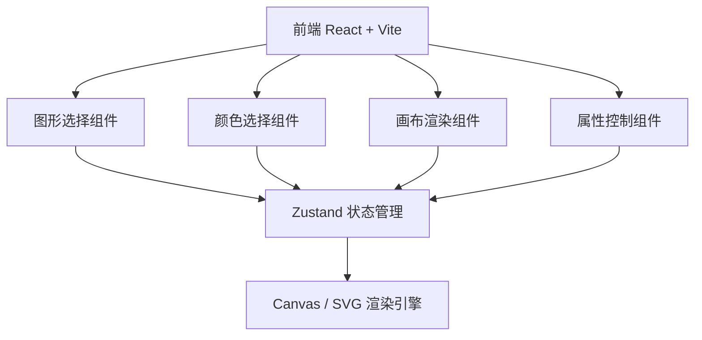
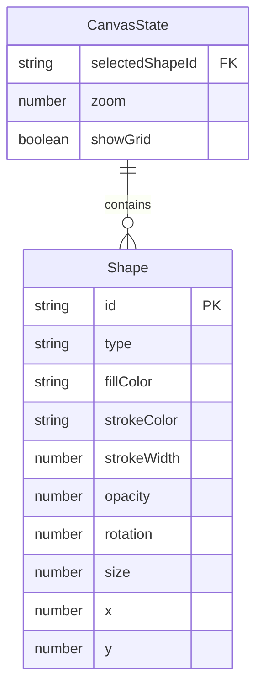

## 1. 架构设计

## 2. 技术说明

- 前端：React@18 + Tailwind CSS@3 + Vite
- 初始化工具：vite-init
- 后端：无
- 数据库：无，使用前端状态管理

## 3. 路由定义

| 路由 | 用途 |
|-----|------|
| / | 主页面，包含图形生成器的所有功能 |

## 4. API定义

不适用，纯前端项目

## 5. 服务端架构图

不适用，纯前端项目

## 6. 数据模型

### 6.1 数据模型定义

### 6.2 数据定义语言

不适用，使用前端 Zustand 状态管理存储数据
