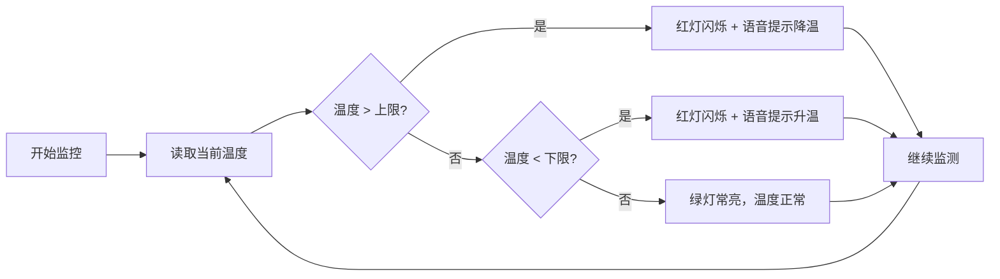

## 1. 产品概述
温度监控模拟器是一个用于模拟温度监控系统的Web应用，实时监控温度变化并根据设定的温度阈值进行状态提示和报警。

- 主要用途：模拟工业或环境温度监控场景，用于教学演示或系统测试
- 目标用户：开发人员、教学人员、系统测试人员
- 核心价值：直观展示温度监控系统的工作原理，支持交互式温度模拟

## 2. 核心功能

### 2.1 功能模块
1. **温度监控面板**：实时温度显示、温度上下限设置、当前状态提示
2. **指示灯系统**：红色闪烁（异常）、绿色常亮（正常）
3. **语音提示系统**：温度异常时自动语音报警
4. **温度模拟器**：手动调节温度或自动模拟温度变化

### 2.2 页面详情
| 页面名称 | 模块名称 | 功能描述 |
|-----------|-------------|---------------------|
| 主页面 | 温度显示区 | 大字号显示当前温度数值，带温度计视觉效果 |
| 主页面 | 阈值设置区 | 滑块或输入框设置温度上限和下限 |
| 主页面 | 状态指示灯 | 根据温度状态显示不同颜色和动画效果 |
| 主页面 | 语音提示区 | 显示当前状态信息，支持语音开关控制 |
| 主页面 | 温度模拟器 | 滑块调节温度、自动模拟温度变化功能 |

## 3. 核心流程
用户打开应用 → 设置温度上下限 → 调节温度或开启自动模拟 → 系统实时监测温度状态
- 温度 > 上限：红灯闪烁 + 语音提示"温度过高，请降温"
- 温度 < 下限：红灯闪烁 + 语音提示"温度过低，请升温"
- 温度正常：绿灯常亮

## 4. 用户界面设计

### 4.1 设计风格
- **主色调**：深色工业风格背景（深灰/深蓝），红色（#ef4444）表示异常，绿色（#22c55e）表示正常
- **按钮样式**：圆角按钮，悬浮时有光泽效果
- **字体**：使用现代无衬线字体，温度数值使用等宽字体增强科技感
- **布局风格**：卡片式布局，信息分区清晰
- **图标**：使用Lucide图标库，风格统一简洁

### 4.2 页面设计概述
| 页面名称 | 模块名称 | UI元素 |
|-----------|-------------|-------------|
| 主页面 | 温度显示区 | 大字号数字、环形进度条、温度计图标、动画过渡效果 |
| 主页面 | 阈值设置区 | 标签、滑块控件、数值显示、单位符号 |
| 主页面 | 状态指示灯 | 圆形发光效果、闪烁动画、状态文字 |
| 主页面 | 语音提示区 | 状态消息框、语音开关按钮、音量图标 |
| 主页面 | 温度模拟器 | 温度调节滑块、自动模拟开关、重置按钮 |

### 4.3 响应性
- Desktop优先设计，采用Flex和Grid布局
- 移动端自适应：单列布局，触控区域优化
- 支持触摸滑动调节温度

### 4.4 动画效果
- 指示灯闪烁：使用CSS keyframes实现呼吸式闪烁
- 温度变化：数字滚动动画效果
- 状态切换：平滑的颜色过渡和缩放效果
- 页面加载：元素渐入动画
