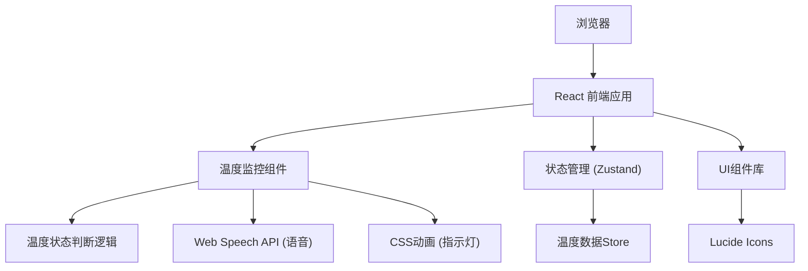

## 1. 架构设计



## 2. 技术描述

- **前端框架**: React@18 + TypeScript + Vite
- **样式方案**: Tailwind CSS@3
- **状态管理**: Zustand
- **图标库**: lucide-react
- **语音功能**: Web Speech API (浏览器原生)
- **动画**: CSS Keyframes + React状态驱动

## 3. 路由定义

| 路由 | 用途 |
|-------|---------|
| / | 主页面 - 温度监控模拟器 |

## 4. 数据模型

### 4.1 状态定义

```typescript
type TemperatureStatus = 'normal' | 'too-high' | 'too-low';

interface TemperatureState {
  currentTemp: number;
  minTemp: number;
  maxTemp: number;
  status: TemperatureStatus;
  voiceEnabled: boolean;
  autoSimulate: boolean;
}
```

### 4.2 Store 设计

```typescript
// zustand store
const useTemperatureStore = create<TemperatureState & Actions>((set, get) => ({
  currentTemp: 25,
  minTemp: 18,
  maxTemp: 30,
  status: 'normal',
  voiceEnabled: true,
  autoSimulate: false,
  
  setCurrentTemp: (temp: number) => set({ currentTemp: temp }),
  setMinTemp: (temp: number) => set({ minTemp: temp }),
  setMaxTemp: (temp: number) => set({ maxTemp: temp }),
  toggleVoice: () => set((state) => ({ voiceEnabled: !state.voiceEnabled })),
  toggleAutoSimulate: () => set((state) => ({ autoSimulate: !state.autoSimulate })),
}));
```

## 5. 组件结构

```
src/
├── components/
│   ├── TemperatureDisplay.tsx    # 温度显示组件
│   ├── ThresholdSettings.tsx     # 阈值设置组件
│   ├── StatusIndicator.tsx       # 状态指示灯组件
│   ├── VoiceControl.tsx          # 语音控制组件
│   └── TemperatureSimulator.tsx  # 温度模拟器组件
├── hooks/
│   ├── useTemperatureMonitor.ts  # 温度监控逻辑hook
│   └── useSpeechSynthesis.ts     # 语音合成hook
├── store/
│   └── temperatureStore.ts       # Zustand状态管理
├── pages/
│   └── IndexPage.tsx             # 主页面
├── App.tsx
└── main.tsx
```

## 6. 核心功能实现要点

### 6.1 温度状态判断逻辑
```typescript
const getStatus = (temp: number, min: number, max: number): TemperatureStatus => {
  if (temp > max) return 'too-high';
  if (temp < min) return 'too-low';
  return 'normal';
};
```

### 6.2 语音提示实现
- 使用 `window.speechSynthesis` API
- 状态变化时触发语音提示
- 增加防抖处理，避免重复播报

### 6.3 指示灯动画
- 使用 CSS `@keyframes` 实现闪烁效果
- 通过 className 动态切换状态样式
- 利用 box-shadow 实现发光效果

### 6.4 自动温度模拟
- 使用 `setInterval` 定期随机调整温度
- 支持手动调节和自动模拟模式切换
