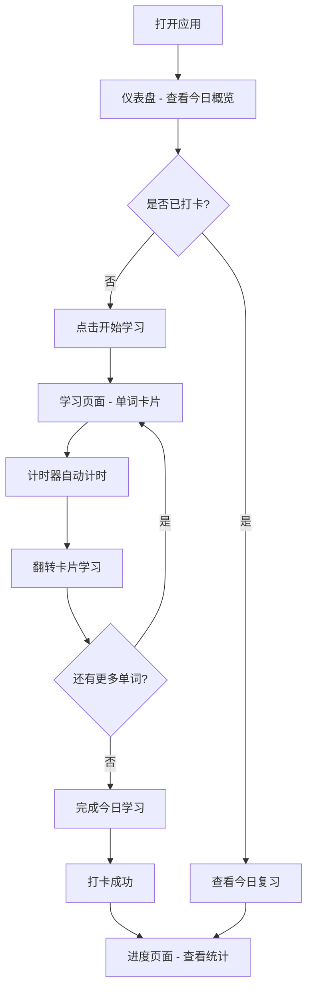

## 1. 产品概述

DailyEng 是一款英文学习桌面应用，专注于日常打卡学英语。通过每日安排学习内容、自动记录学习时长和完成情况，帮助用户建立持续的英语学习习惯。

- 核心目标：帮助用户通过每日打卡和系统化的学习安排，养成持续学习英语的习惯
- 目标用户：希望每天坚持学英语的学生、职场人士和英语爱好者

## 2. 核心功能

### 2.1 用户角色
| 角色 | 注册方式 | 核心权限 |
|------|----------|----------|
| 普通用户 | 无需注册，本地使用 | 使用全部学习功能、查看进度 |

### 2.2 功能模块
1. **仪表盘页面**：今日打卡、连续学习天数、今日学习概览、快捷操作入口
2. **学习页面**：单词卡片学习、短语/例句学习、学习计时器、学习内容导航
3. **进度页面**：学习时长统计、完成率图表、历史打卡日历、详细学习记录

### 2.3 页面详情
| 页面名称 | 模块名称 | 功能描述 |
|----------|----------|----------|
| 仪表盘 | 打卡模块 | 显示今日打卡状态，点击完成打卡，展示连续打卡天数 |
| 仪表盘 | 今日概览 | 显示今日待学习单词数量、已学习数量、预计学习时长 |
| 仪表盘 | 快捷入口 | 快速进入今日学习、查看进度等操作按钮 |
| 仪表盘 | 学习名言 | 每日展示一条英语励志名言 |
| 学习 | 单词卡片 | 翻转卡片展示单词、音标、释义、例句，支持标记已掌握/未掌握 |
| 学习 | 学习计时器 | 自动记录本次学习时长，支持暂停/继续 |
| 学习 | 内容导航 | 在今日单词列表中切换，显示当前进度 |
| 学习 | 短语学习 | 展示常用短语及其用法和例句 |
| 进度 | 学习统计 | 本周/本月学习时长统计图表，每日学习时长柱状图 |
| 进度 | 完成率 | 每日学习任务完成率，环形进度图 |
| 进度 | 打卡日历 | 日历视图展示打卡记录，已打卡日期高亮标记 |
| 进度 | 历史记录 | 按日期查看历史学习详情，包括学过的单词和时长 |

## 3. 核心流程

用户打开应用 → 查看仪表盘今日学习概览 → 点击开始学习 → 进入学习页面，翻转单词卡片 → 计时器自动计时 → 完成今日学习任务 → 打卡 → 查看进度统计

## 4. 用户界面设计

### 4.1 设计风格
- 主色调：深墨绿 (#1B4332) + 明亮翡翠绿 (#52B788) 作为强调色
- 辅助色：温暖米白 (#FAF3E0) 背景 + 深炭灰 (#2D3436) 文字
- 按钮风格：圆角胶囊按钮，带微妙的渐变和阴影
- 字体：Playfair Display（标题）+ DM Sans（正文），优雅且有书卷气息
- 布局风格：左侧固定导航栏 + 右侧内容区，卡片式布局
- 图标风格：线性风格图标，统一使用 lucide-react
- 整体风格：学院风/书房感，营造沉浸式学习氛围

### 4.2 页面设计概览
| 页面名称 | 模块名称 | UI 元素 |
|----------|----------|---------|
| 仪表盘 | 打卡模块 | 大号打卡按钮，脉冲动画，连续天数火焰图标 |
| 仪表盘 | 今日概览 | 统计卡片（带图标），进度条，渐变背景 |
| 仪表盘 | 学习名言 | 居中引用样式，装饰性引号图标 |
| 学习 | 单词卡片 | 3D 翻转卡片动画，正面英文/背面中文释义，底部操作按钮 |
| 学习 | 计时器 | 圆形计时器，渐变边框，暂停/继续按钮 |
| 学习 | 内容导航 | 底部点状进度指示器，左右切换箭头 |
| 进度 | 学习统计 | 渐变柱状图，周/月切换标签 |
| 进度 | 完成率 | 环形进度图，中心显示百分比 |
| 进度 | 打卡日历 | 月历网格，已打卡日期绿色圆点标记 |
| 进度 | 历史记录 | 列表卡片，展示日期、时长、单词数 |

### 4.3 响应式设计
- 桌面优先设计，最小宽度 1024px
- 左侧导航栏固定 240px 宽度
- 内容区域自适应填充剩余空间
- 不支持移动端适配（桌面应用）

### 4.4 3D 场景
- 不适用
