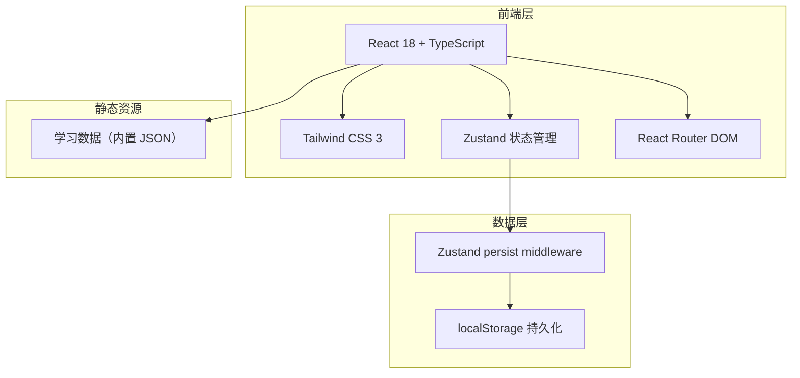
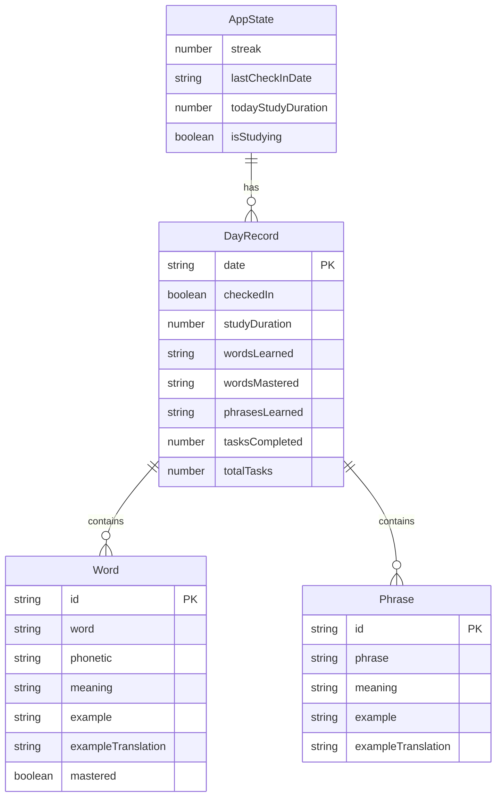

## 1. 架构设计



## 2. 技术说明
- 前端：React@18 + Tailwind CSS@3 + Vite + TypeScript
- 初始化工具：vite-init
- 后端：无（纯前端应用，数据存储在 localStorage）
- 数据库：无（使用 localStorage + Zustand persist 中间件持久化数据）
- 状态管理：Zustand（含 persist 中间件自动同步 localStorage）
- 路由：React Router DOM v6
- 图标：lucide-react
- 动画：CSS transitions + keyframes（3D 翻转卡片等）

## 3. 路由定义
| 路由 | 用途 |
|------|------|
| / | 仪表盘页面 - 今日打卡、学习概览、快捷入口 |
| /learn | 学习页面 - 单词卡片、短语学习、计时器 |
| /progress | 进度页面 - 学习统计、打卡日历、历史记录 |

## 4. API 定义
无后端 API，所有数据通过 Zustand store 和 localStorage 管理。

### 数据接口定义

```typescript
interface Word {
  id: string
  word: string
  phonetic: string
  meaning: string
  example: string
  exampleTranslation: string
  mastered: boolean
}

interface Phrase {
  id: string
  phrase: string
  meaning: string
  example: string
  exampleTranslation: string
}

interface DayRecord {
  date: string
  checkedIn: boolean
  studyDuration: number
  wordsLearned: string[]
  wordsMastered: string[]
  phrasesLearned: string[]
  tasksCompleted: number
  totalTasks: number
}

interface AppState {
  streak: number
  lastCheckInDate: string | null
  dayRecords: Record<string, DayRecord>
  currentDayWords: Word[]
  currentDayPhrases: Phrase[]
  isStudying: boolean
  currentStudyStart: number | null
  todayStudyDuration: number
}
```

## 5. 服务器架构图
不适用（纯前端应用）

## 6. 数据模型

### 6.1 数据模型定义



### 6.2 数据定义语言
使用 localStorage 存储，结构为 JSON。学习内容数据内置于 `src/data/` 目录下的 JSON 文件中，按日期分配每日学习内容。
