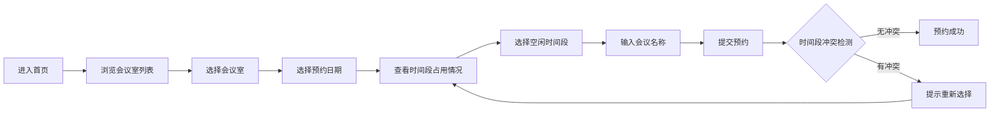

## 1. 产品概述

会议室预约系统是一个用于企业或组织内部会议室资源管理的Web应用，解决会议室预约冲突、资源调度不透明的问题。目标用户包括需要预约会议室的普通员工和负责管理会议室资源的管理员。

产品价值在于提升会议室使用效率，减少预约冲突，实现会议室资源的可视化管理和自动化调度。

## 2. 核心功能

### 2.1 用户角色

| 角色 | 说明 | 核心权限 |
|------|------|----------|
| 普通用户 | 系统使用者，需要预约会议室的人员 | 浏览会议室列表、查看预约情况、创建新预约、取消自己的预约 |
| 管理员 | 系统管理者，负责会议室资源维护 | 会议室增删改查、查看所有预约、管理预约记录 |

### 2.2 功能模块

1. **预约首页**：会议室展示、日期选择、时间段选择、会议名称输入、提交预约
2. **预约列表**：展示当前已有的预约记录，支持按日期和会议室筛选
3. **管理后台**：会议室管理（增删改查）、预约记录管理

### 2.3 页面详情

| 页面名称 | 模块名称 | 功能描述 |
|-----------|-------------|---------------------|
| 预约首页 | 会议室选择 | 展示所有可用会议室卡片，显示容纳人数、设备配置等信息，支持点击选择 |
| 预约首页 | 日期选择器 | 日历组件，支持选择预约日期，高亮显示有预约的日期 |
| 预约首页 | 时间段选择 | 时间轴展示，可视化显示已占用时间段，支持点击选择空闲时段 |
| 预约首页 | 预约表单 | 输入会议名称、参会人数，提交预约申请 |
| 预约列表 | 预约记录 | 表格展示所有预约，包含会议室名称、日期、时间段、会议名称、操作按钮 |
| 管理后台 | 会议室管理 | 会议室列表展示，新增、编辑、删除会议室表单 |
| 管理后台 | 预约管理 | 查看所有预约记录，支持取消预约 |

## 3. 核心流程

用户进入首页后，首先浏览可用会议室，选择目标会议室后，在日历上选择预约日期，系统自动展示该日该会议室的时间段占用情况，用户点击选择空闲时间段，输入会议名称后提交预约，系统验证时间段无冲突后保存预约记录。

管理员在后台可以管理会议室信息，包括新增、编辑、删除会议室，查看所有预约记录。

## 4. 用户界面设计

### 4.1 设计风格

- **主色调**：深蓝色（#1e3a8a）作为主色，代表专业和可信赖；天蓝色（#3b82f6）作为交互色
- **辅助色**：绿色（#10b981）表示可用/成功，橙色（#f59e0b）表示警告，红色（#ef4444）表示错误
- **中性色**：使用 slate 色系，从 slate-50 到 slate-900 构建层次
- **按钮风格**：圆角（rounded-lg），轻微阴影，hover状态有上浮效果
- **字体**：标题使用 Noto Sans SC，正文使用系统默认无衬线字体
- **布局风格**：卡片式布局，顶部导航栏，内容区左右分栏（会议室列表 + 预约面板）
- **图标风格**：使用 lucide-react 图标库，统一线性风格

### 4.2 页面设计概述

| 页面名称 | 模块名称 | UI元素 |
|-----------|-------------|-------------|
| 预约首页 | 会议室卡片 | 渐变背景卡片，悬停放大动画，显示容纳人数图标、设备图标 |
| 预约首页 | 日历组件 | 网格布局，今日高亮，有预约日期显示圆点标记，选中日期有边框动画 |
| 预约首页 | 时间轴 | 水平时间条，不同颜色区分空闲/已占用，点击选择有过渡动画 |
| 预约首页 | 表单区域 | 浮动标签输入框，提交按钮有加载状态动画 |
| 预约列表 | 数据表格 | 斑马纹行，悬停高亮，操作按钮组 |
| 管理后台 | 会议室表单 | 模态框弹窗，表单验证提示，保存成功反馈 |

### 4.3 响应式

采用桌面优先设计，适配以下断点：
- 桌面端（≥1024px）：三栏布局 - 导航栏 + 会议室列表 + 预约详情
- 平板端（768px-1023px）：两栏布局 - 会议室列表可折叠，预约详情全宽
- 移动端（<768px）：单列布局，会议室列表为横向滚动卡片，预约表单垂直堆叠
- 所有交互元素确保最小44x44px触摸区域，优化移动端点击体验

### 4.4 交互动效

- 页面加载：元素渐入动画，按布局区域依次显示（staggered reveal）
- 会议室卡片：hover时轻微上浮（translateY(-4px)），阴影加深
- 时间段选择：选中时有缩放动画，颜色渐变过渡
- 表单提交：按钮显示加载状态，成功后显示绿色对勾动画
- 模态框：背景模糊 + 缩放进入动画
- 时间轴：已占用区域有脉冲呼吸效果提示
