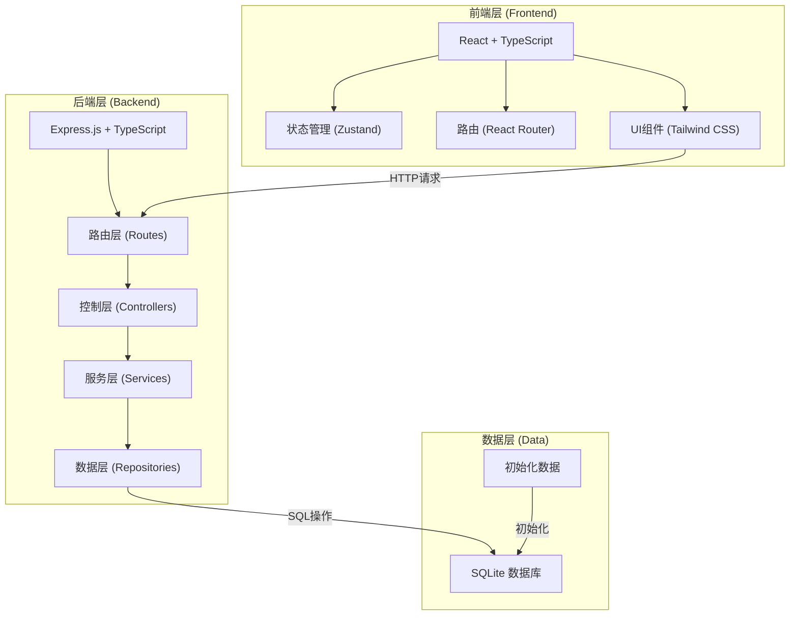
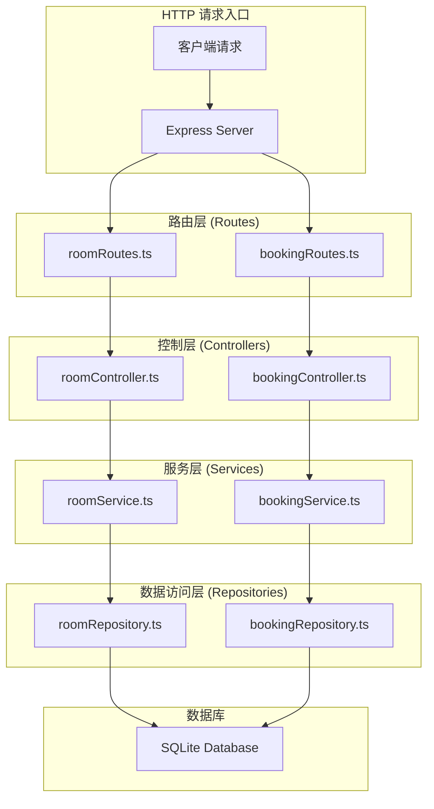
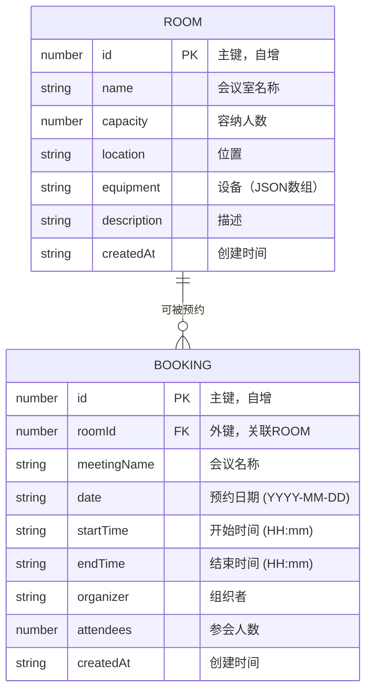

## 1. 架构设计

系统采用前后端分离的全栈架构，前端使用React构建用户界面，后端使用Express提供RESTful API服务，数据持久化采用SQLite轻量级数据库，便于部署和快速开发。



## 2. 技术描述

- **前端框架**: React@18 + TypeScript
- **构建工具**: Vite@5
- **状态管理**: Zustand@4
- **路由管理**: react-router-dom@6
- **UI样式**: Tailwind CSS@3
- **图标库**: lucide-react@0.344
- **后端框架**: Express@4 + TypeScript
- **数据库**: SQLite（使用better-sqlite3驱动）
- **跨域处理**: cors@2.8.5
- **HTTP客户端**: fetch API (浏览器原生)

## 3. 路由定义

### 前端路由

| 路由路径 | 页面名称 | 功能描述 |
|----------|----------|----------|
| `/` | 预约首页 | 会议室选择、日期时间选择、预约表单 |
| `/bookings` | 预约列表 | 展示所有预约记录，支持筛选 |
| `/admin` | 管理后台 | 会议室CRUD、预约管理 |

### 后端API路由

| 路由路径 | HTTP方法 | 功能描述 |
|----------|----------|----------|
| `/api/rooms` | GET | 获取所有会议室列表 |
| `/api/rooms` | POST | 新增会议室 |
| `/api/rooms/:id` | GET | 获取单个会议室详情 |
| `/api/rooms/:id` | PUT | 更新会议室信息 |
| `/api/rooms/:id` | DELETE | 删除会议室 |
| `/api/bookings` | GET | 获取所有预约（支持按日期、会议室筛选） |
| `/api/bookings` | POST | 创建新预约 |
| `/api/bookings/:id` | GET | 获取单个预约详情 |
| `/api/bookings/:id` | DELETE | 取消/删除预约 |
| `/api/bookings/check` | POST | 检查时间段是否可用 |

## 4. API 类型定义

```typescript
// 共享类型定义 (shared/types.ts)

// 会议室类型
export interface Room {
  id: number;
  name: string;
  capacity: number;
  location: string;
  equipment: string[];
  description?: string;
  createdAt: string;
}

// 预约类型
export interface Booking {
  id: number;
  roomId: number;
  roomName: string;
  meetingName: string;
  date: string;           // YYYY-MM-DD 格式
  startTime: string;      // HH:mm 格式
  endTime: string;        // HH:mm 格式
  organizer: string;
  attendees?: number;
  createdAt: string;
}

// 创建会议室请求
export interface CreateRoomRequest {
  name: string;
  capacity: number;
  location: string;
  equipment: string[];
  description?: string;
}

// 更新会议室请求
export type UpdateRoomRequest = Partial<CreateRoomRequest>;

// 创建预约请求
export interface CreateBookingRequest {
  roomId: number;
  meetingName: string;
  date: string;
  startTime: string;
  endTime: string;
  organizer: string;
  attendees?: number;
}

// 时间段冲突检查请求
export interface CheckAvailabilityRequest {
  roomId: number;
  date: string;
  startTime: string;
  endTime: string;
  excludeBookingId?: number;
}

// 时间段冲突检查响应
export interface CheckAvailabilityResponse {
  available: boolean;
  conflictBookings?: Booking[];
}

// API响应包装
export interface ApiResponse<T> {
  success: boolean;
  data?: T;
  message?: string;
  error?: string;
}
```

## 5. 服务器架构图

后端采用经典的三层架构，分离关注点，便于维护和扩展。



## 6. 数据模型

### 6.1 实体关系图



### 6.2 数据库DDL语句

```sql
-- 会议室表
CREATE TABLE IF NOT EXISTS rooms (
    id INTEGER PRIMARY KEY AUTOINCREMENT,
    name VARCHAR(100) NOT NULL UNIQUE,
    capacity INTEGER NOT NULL CHECK (capacity > 0),
    location VARCHAR(200) NOT NULL,
    equipment TEXT NOT NULL DEFAULT '[]',
    description TEXT,
    createdAt DATETIME DEFAULT CURRENT_TIMESTAMP
);

-- 预约表
CREATE TABLE IF NOT EXISTS bookings (
    id INTEGER PRIMARY KEY AUTOINCREMENT,
    roomId INTEGER NOT NULL,
    meetingName VARCHAR(200) NOT NULL,
    date DATE NOT NULL,
    startTime TIME NOT NULL,
    endTime TIME NOT NULL,
    organizer VARCHAR(100) NOT NULL,
    attendees INTEGER DEFAULT 1,
    createdAt DATETIME DEFAULT CURRENT_TIMESTAMP,
    FOREIGN KEY (roomId) REFERENCES rooms(id) ON DELETE CASCADE
);

-- 索引：优化按日期和会议室查询
CREATE INDEX IF NOT EXISTS idx_bookings_date_room ON bookings(date, roomId);
CREATE INDEX IF NOT EXISTS idx_bookings_room ON bookings(roomId);

-- 初始化会议室数据
INSERT OR IGNORE INTO rooms (name, capacity, location, equipment, description) VALUES
    ('星辰会议室', 10, 'A座3楼301', '["投影仪","白板","视频会议系统"]', '适合中小型会议，配备高清投影设备'),
    ('云海会议室', 20, 'A座5楼501', '["投影仪","白板","音响系统","视频会议系统"]', '大型会议室，可容纳20人，适合部门会议'),
    ('灵动会议室', 6, 'B座2楼201', '["电视屏幕","白板"]', '小型讨论室，适合头脑风暴和小组讨论'),
    ('宏图会议室', 30, 'A座8楼801', '["投影仪","专业音响","视频会议系统","白板","录音设备"]', '多功能会议厅，适合全公司大会和重要客户接待');
```

### 6.3 项目目录结构

```
yuyue/
├── .trae/
│   └── documents/
│       ├── prd.md
│       └── tech-architecture.md
├── src/                    # 前端代码
│   ├── components/         # 可复用组件
│   │   ├── RoomCard.tsx
│   │   ├── Calendar.tsx
│   │   ├── TimeSlot.tsx
│   │   ├── BookingForm.tsx
│   │   ├── Navbar.tsx
│   │   └── Modal.tsx
│   ├── pages/              # 页面组件
│   │   ├── Home.tsx
│   │   ├── BookingList.tsx
│   │   └── Admin.tsx
│   ├── store/              # 状态管理
│   │   ├── useRoomStore.ts
│   │   └── useBookingStore.ts
│   ├── utils/              # 工具函数
│   │   ├── api.ts
│   │   └── dateUtils.ts
│   ├── App.tsx
│   ├── main.tsx
│   └── index.css
├── api/                    # 后端代码
│   ├── src/
│   │   ├── controllers/
│   │   │   ├── roomController.ts
│   │   │   └── bookingController.ts
│   │   ├── services/
│   │   │   ├── roomService.ts
│   │   │   └── bookingService.ts
│   │   ├── repositories/
│   │   │   ├── roomRepository.ts
│   │   │   └── bookingRepository.ts
│   │   ├── routes/
│   │   │   ├── roomRoutes.ts
│   │   │   └── bookingRoutes.ts
│   │   ├── db/
│   │   │   └── index.ts
│   │   └── server.ts
│   └── tsconfig.json
├── shared/                 # 共享类型
│   └── types.ts
├── vite.config.ts
├── tsconfig.json
├── tailwind.config.js
├── postcss.config.js
└── package.json
```
